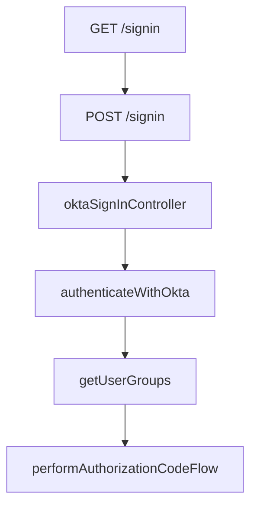
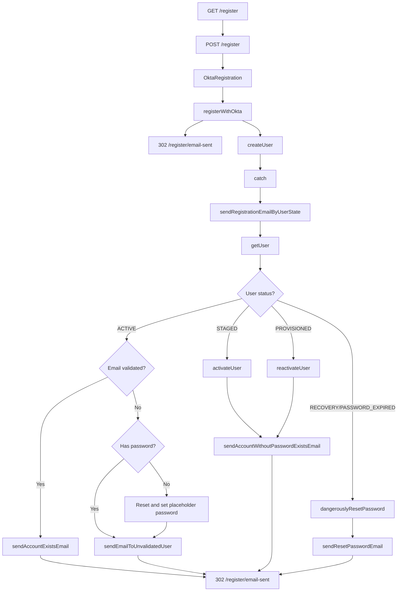
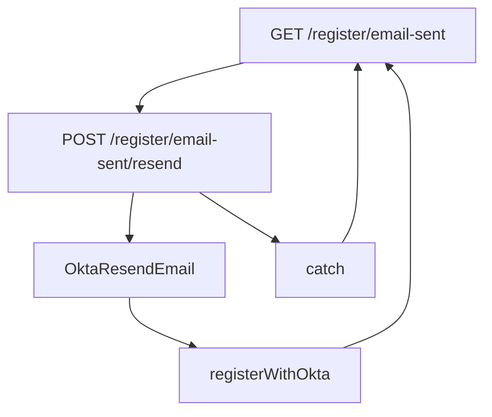
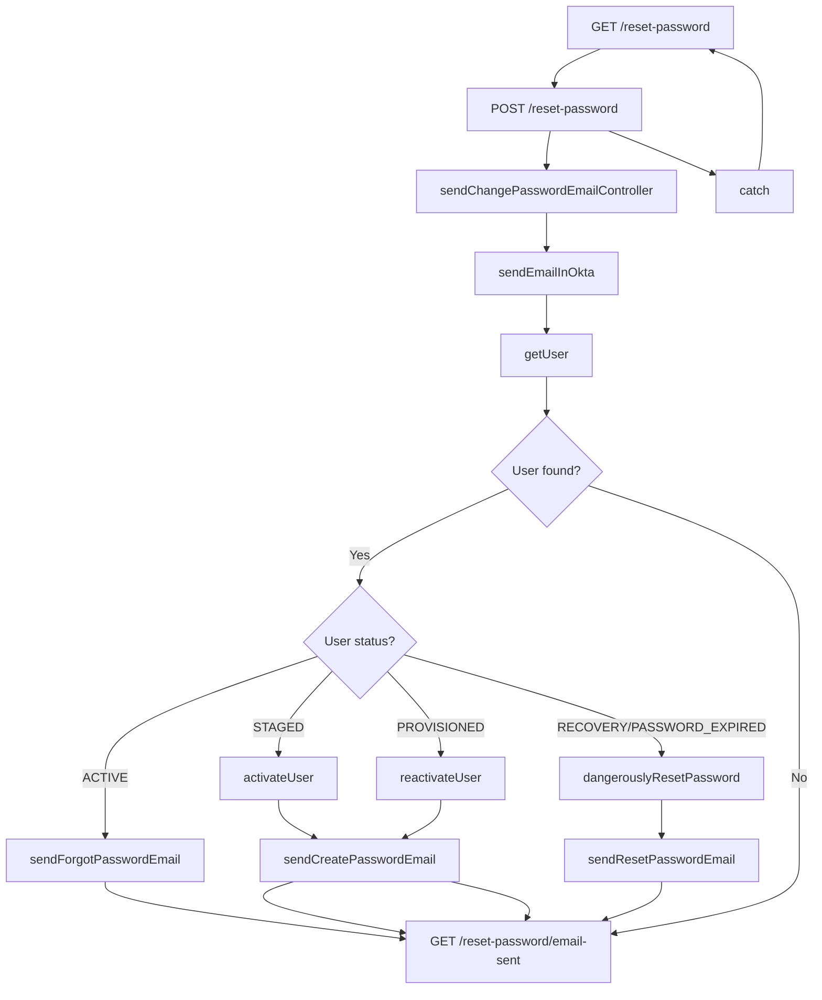

# Flow diagrams for common Gateway routes

**_Note: These diagrams are outdated and describe behaviour for the older Okta Classic API. For more up to date flows using the newer Okta IDX API, see the [IDX Documentation](./okta/idx/README.md)_**

## Sign in

_Note: See [IDX Sign In](./okta/idx/sign-in-idx.md) for the most up to date flow_

## Register / Create Account

_Note: See [IDX Create Account](./okta/idx/create-account-idx.md) for the most up to date flow for new users_

### Resend registration email

## Reset password

_Note: See [IDX Reset Password](./okta/idx/reset-password-idx.md) for the most up to date flow_

