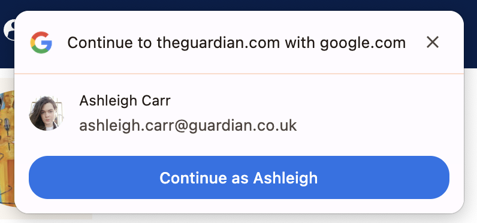
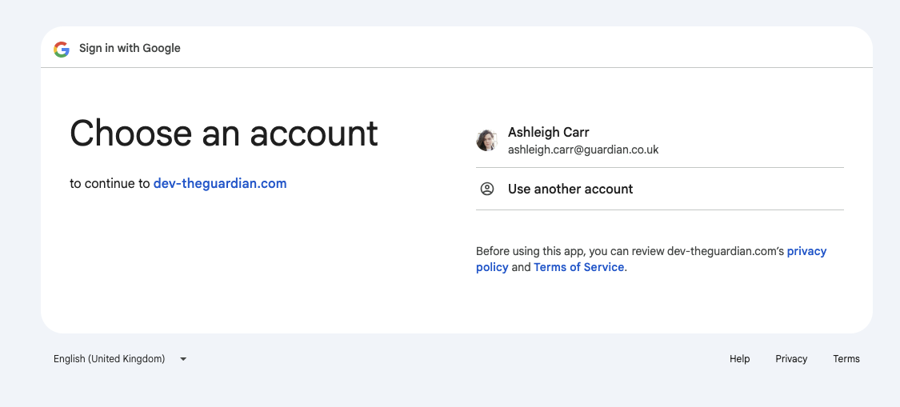
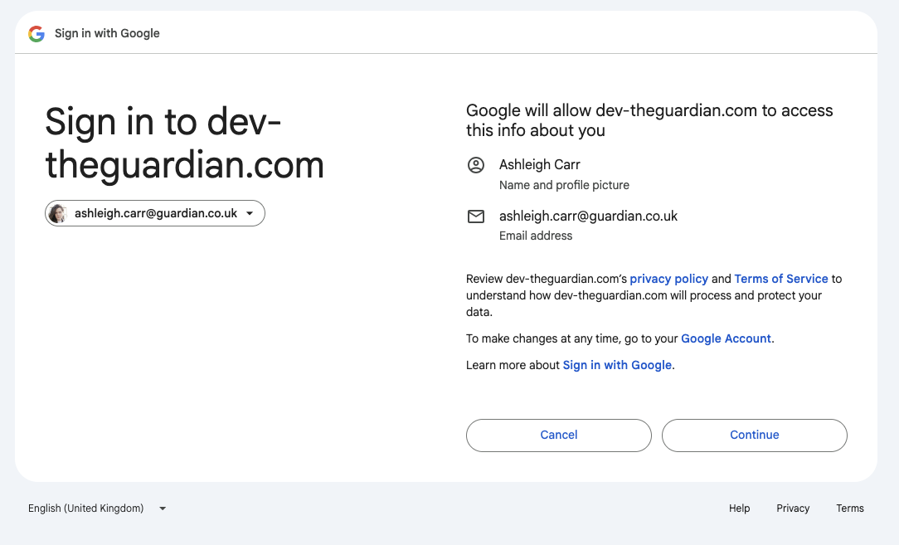
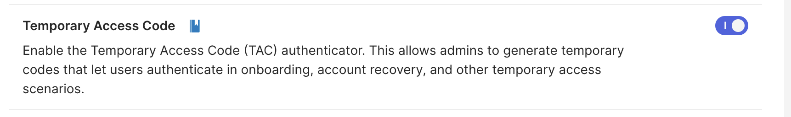
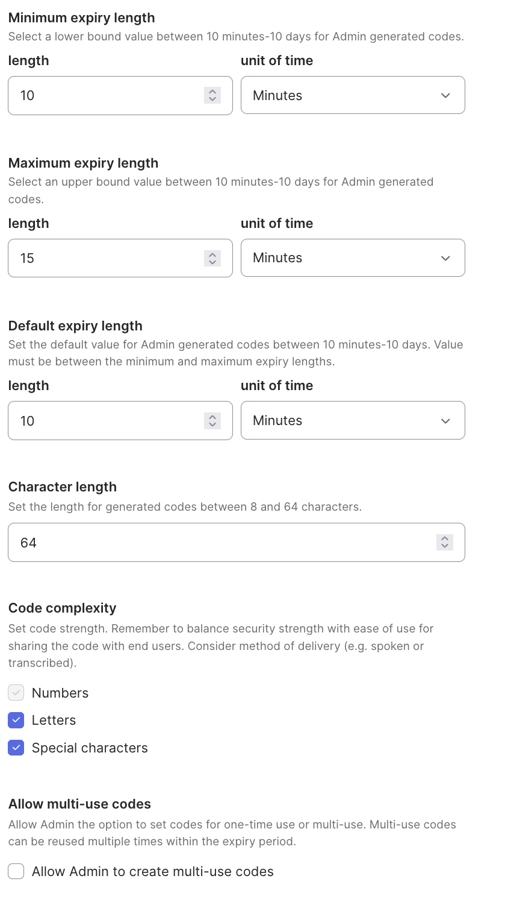
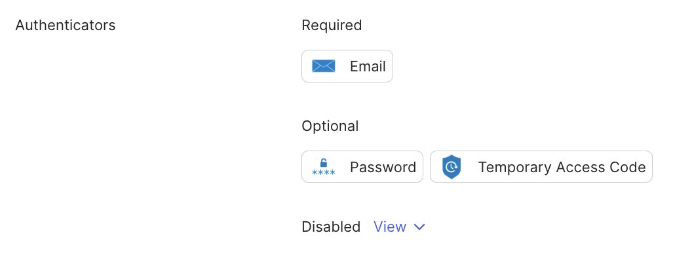
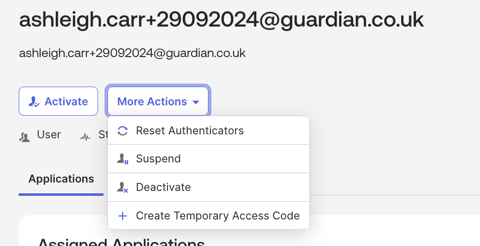

# Google One Tap

Allow users to directly sign in to The Guardian using their Google accounts straight from the homepage.



# Client Side Implementation

Googles recommended approach is to use their [GSI library which adds the required scripts to load Google One Tap onto a page](https://developers.google.com/identity/gsi/web/guides/get-google-api-clientid#load_the_client_library), however this creates a host of issues and concerns around privacy and performance. Googles GSI bundle is ~250KB uncompressed, and includes a lot of behaviour unrelated to Google One Tap which might track the user and require unecessary compute to parse.

We decided to avoid using GSI and instead build the Google One Tap functionality ourselves, as it turns out this is fairly trivial to do. Previously Google One Tap was rendered by an IFrame which was initialized by the GSI bundle, however the past few years Browsers have been implementing the new [FedCM API](https://developer.mozilla.org/en-US/docs/Web/API/FedCM_API) which natively implements Google One Tap (and other providers). Google themselves suggest using the [FedCM API](https://developers.google.com/identity/gsi/web/guides/fedcm-migration) for new applications.

To use Google One Tap with FedCM we're told to enable the [`use_fedcm_for_prompt`](https://developers.google.com/identity/gsi/web/reference/js-reference#use_fedcm_for_prompt) parameter when initializing GSI, but under the hood this just calls the native FedCM API to render the prompt, something we can do ourselves. The FedCM API is still fairly undocumented and experimental, and at time of writing I couldn't find any sources describing how you would use it to initialize Google One Tap, but its API is fairly intuitive to work out, I've documented a barebones implementation of it below:

```js
window.navigator.credentials
	.get({
		// There are various different credentials that can be retrieved using the Credentials Management API
		// such as One Time Passwords and Public Keys, but in our case we want FedCM credentials which is configured
		// via the `identity` property
		identity: {
			providers: [
				// In theory the FedCM supports providers other than Google so you could have a "Apple One Tap" or a "Guardian One Tap"
				// listed here too, but I'm not entirely sure how well this works in practice.
				{
					// Couldn't find this endpoint documented anywhere but discovered it
					// by observing GSI network traffic.
					configURL: 'https://accounts.google.com/gsi/fedcm.json',
					// Google Client ID used for Social Sign In
					clientID: '',
				},
			],
		},
	})
	.catch((error) => {
		if (error instanceof Error && error.name === 'NetworkError') {
			// To avoid revealing if a user has a Google account the FedCM API throws a NetworkError at a random duration
			// after the user rejected the prompt. This way the website can't tell if the prompt was rejected or if there was
			// an actual NetworkError.
		}

		throw error;
	})
	.then((credentials) => {
		// If the user accepted the prompt we should receive a IdentityCredentials object containing
		// an Google ID Token for the user.
		console.log(credentials.token);
	});
```

After the user accepts the prompt we (the Javascript on the page) receives a [`IdentityCredentials`](https://developer.mozilla.org/en-US/docs/Web/API/IdentityCredential) instance which contains the users Google ID Token, which is a [Json Web Token](https://en.wikipedia.org/wiki/JSON_Web_Token) containing the users details such as Email, First Name, and Last name. This token is signed by Google so in theory we should be able to trust this token as a form of authentication, however due to limitations with Okta which I'll get into when we get to the [server side implementation](#server-side-implementations) all we can do with the token is extract the users email address and redirect them to Gateway.

We could include the users full token when redirecting them to Gateway, this is what other sites do to authenticate user, but as we only need the users Email address in our case we extract it on the client side to avoid sending unecessary user information over the network. In the future, if we ever revisit Google One Tap for a phase 2 where we need the full token it should be safe to send it over the network, although possibly should be done in a `POST` request instead of a `GET` request to avoid users ID token showing up in network logs.

An important side-effect, which will also be talked about in more detail in the [server side implementation](#server-side-implementations) is that by Accepting the Google One Tap prompt they add "The Guardian" as a trusted third party to their Google Account which will be relevant later.

The Client Side Implementation can be found inside the [`GoogleOneTap.importable.tsx`](https://github.com/search?q=repo%3Aguardian%2Fdotcom-rendering+GoogleOneTap.importable.tsx&type=code) island in DCR.

# Server Side Implementations

Whilst scoping Google One Tap we came up with 2 approaches for how we could implement it given Oktas Limitations.

- **[Enhanced Social Sign In](#enhanced-social-sign-in-approach)** - A slightly modified version of the Social Sign in Flow which takes advantage of the `login_hint` parameter to sign a reader into an existing Google session.
- **[Authoritative](#authoritative)** - Entirely new sign in route where Gateway treats the Google One Tap ID Token as authoritative and directly logs the reader in without relying on Social Sign On.

Due to the complexity and security concerns we decided to go with the [Enhanced Social Sign In](#enhanced-social-sign-in-approach)] for the time being, but we'll keep the door open to potentially go down the [Authoritative](#authoritative) approach in future if we need more flexibility.

## Enhanced Social Sign In Approach

Okta does not support signing in directly with a Google One Tap ID Token, instead what Okta have suggested that we do is to redirect the user to the Google Social Sign In flow if the user
accepts the Google One Tap prompt. In theory we can do this transparently, as the email address we get from Google One Tap, and the side effect that accepting the prompt consents the user to share their data with the Guardian, allows us to skip all of the pages in the Google OAuth flow.

This works thanks to Googles support for the `login_hint` parameter in their OAuth flow. The `login_hint` parameter is a string field which accepts a users email address, this is useful to us as when we send the user to Google to sign in if they have an account that matches the specified email address we skip the first page of the sign in flow where the user is asked which account they want to sign in as, or if they only have the 1 account if they want to add another.



Since accepting the Google One Tap prompt consents the reader to sharing their Google data with The Guardian the 2nd page in the Google OAuth page which asks the user if they want to share their data is also skipped.



In theory, with both these pages getting skipped, the user should only see a brief flash as we redirect the user to Google, Google verifies they're signed in, and then redirects the user back to Okta/Gateway. Once the user is redirected back to us we should have their Google OAuth authorization token the same way we would for any other Social Sign In which we can use to register an account or sign the user in via Okta.

From an implementation perspective this is quite a straightforward approach, we just need to accept the `signInEmail` parameter on the `/signin/google` path which passes the inputed email through to the Google OAuth pages, there are however 2 major caviats to this approach:

- Googles OAuth flow does not work in an IFrame, this means that we have to redirect the user to Google in order to log them in. Some websites open a dialog box after the user accepts Google One Tap so that the user can finish setting up their account without ever having to leave the page.
- We have to trust that the Google OAuth flow doesn't change, if for some reason the users start seeing the first or second page we wouldn't really know unless someone tells us. Its also quite hard for us to have automated tests for this due to the pages being owned by Google.

## Authoritative Approach

The previous approach essentially involves authenticating the user twice, once when they accept the Google One Tap prompt, and again once they're directed to the Google Social Sign In flow. The main issue here is UX, the redirection to Googles Sign In flow will cause a brief flash of white as Google verifies the user identity, and we can't do this in an iframe meaning that the user has to be redirected away from whatever article they're reading in order to complete their login.

In theory just authenticating with the Google One Tap prompt should be sufficient as the ID Token returned by Google is trustworthy enough to be considered as a valid form of credentials. The main issue is how we exchange a Google ID Token into an Okta Access Token, as Okta's API doesn't have an explicit way of doing this we need to rely on a workaround.

Okta doesn't let you arbitrarily generate access tokens for users, you must have the users credentials in order to sign them in. Typically the users credentials would either be a passcode, or a password. We can't use Passcodes as generating one would send an email to the user, and we can't use Passwords as we wouldn't know the users Password. We could set a placeholder password, but this would mean resetting the users password every time they log in with Google One Tap.

What we can use however is an early access feature Okta has been working on called "Temporary Access Codes" (TAC), the intended usecase for Temporary Access Codes is to allow an admin to send a user a one time use passcode via a medium such as IM if they get locked out of their account. Unlike Passcodes, TACs aren't sent to the users email address, they're instead shown to the admin that initiated the TAC request, this means we can create an authentication factor for the user without triggering an email or resetting the users password.

### Enabling Temporary Access Codes

At time of writing its not possible to use Terraform to enable TAC features and they must be enabled manually via the Okta Console, this can be done from the `Settings > Features` page under "Early access" features:



Next create a new Authenticator under `Security -> Authenticators -> Add authenticator` and select "Temporary Access Code". As we're using the TACs programatically we should make them expire as quickly as possible and as complex as possible:



Lastly add TAC as an Optional factor to the "guardian user passwordless policy" under `Security -> Authenticators -> Enrollment`



### Generating TACs

From the Okta console a TAC can be generated by searching for a user in the Okta directory, then under "More Actions" there should be the option to generate a TAC assuming they've been enabled correctly.



Programatically TACs can be generated using [Oktas Create TAC Authenticator Enrollment API](https://developer.okta.com/docs/api/openapi/okta-management/management/tag/UserAuthenticatorEnrollments/#tag/UserAuthenticatorEnrollments/operation/createTacAuthenticatorEnrollment), this endpoint accepts a User ID and creates a TAC for that user which is returned in the API response.

### Authenticating with a TAP

Authenticating with a TAC functions very similarly to Passcode authentication, most steps are identical to signing in with Passcode which is detailed in the [sign-in.idx.md](okta/idx/sign-in-idx.md) document.

The key difference between the Passcode sign in flow and the Temporary Access sign in flow is that we don't need to wait for user input, we can Interact, Introspect, Identify, Challenge, and Answer Challenge in the same Gateway API call.

If you've generated a TAC for the user you should see a "temporary access code" authenticator in the 'select-authenticator-authenticate' remediation of the Identify response. Note that if the user is not enrolled in a TAC this authenticator will not appear in the response.

[#3255](https://github.com/guardian/gateway/pull/3255) A proof of concept PR which adds a new route to Gateway that performs TAC authentication for Google One Tap can be found here

# Related Code

- [Client Side Implementation (DCR)](https://github.com/guardian/dotcom-rendering/blob/main/dotcom-rendering/src/components/GoogleOneTap.importable.tsx)
- [Server Side Implementation: Enhanced Social Sign In (Gateway)](https://github.com/guardian/gateway/pull/3259)
- [Proof of Concept Server Side Implementation: Authoritative Implementation (Gateway)](https://github.com/guardian/gateway/pull/3255)
