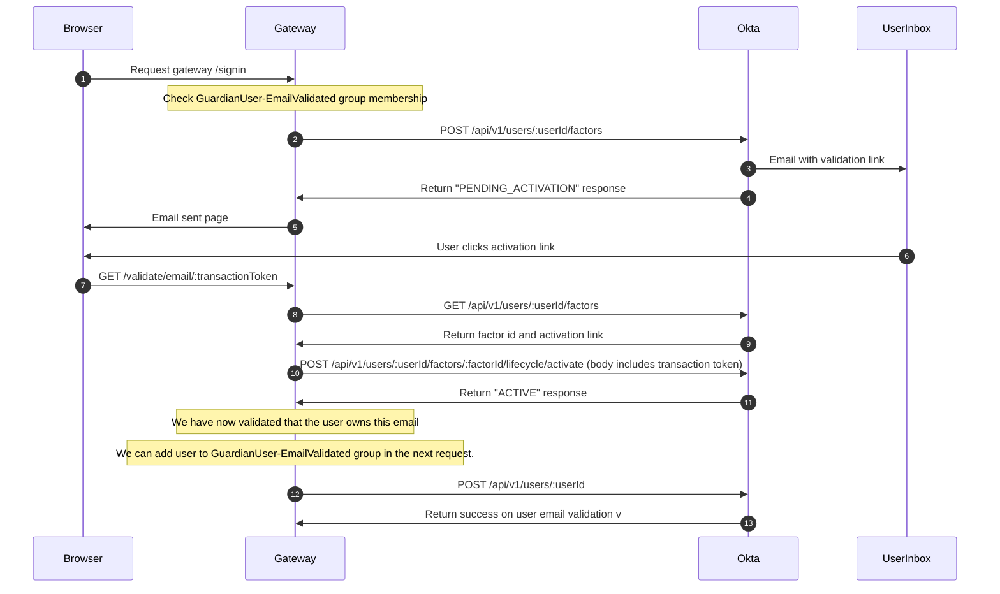

# User email validation in Okta

We approach user email validation using the Okta Factors API. We leverage the "email" factor that they include as part of this feature set to validate (or revalidate) that they own the email that they are signed up under.

This approach allows us to validate the email of individual users without having to follow the account lifecycle deactivate/reactivate flow — which would require the user to also reset their password, an undesirable side effect.

## Example user journey

The following is the user journey that we are implementing which necessitates having this functionality available to us as part of our integration with the Okta platform.

- Given my password is strong and my email is not validated
- When I am trying to sign in via email
- Then I should be asked to validate my email

## Steps

This is the process for validating a users' email using the Okta Factors API.

1. We request an “Enrollment” for the user against the Okta email factor by making a POST request to this endpoint: [/api/v1/users/:userId/factors](https://developer.okta.com/docs/reference/api/factors/#enroll-okta-email-factor)
   - The request body included [looks like this](https://developer.okta.com/docs/reference/api/factors/#request-example-25):

```json
{
  "factorType": "email",
  "provider": "OKTA",
  "profile": {
    "email": "test@gmail.com"
  }
}
```

2. The response from Okta indicates that the users' email factor has been placed in a `PENDING_ACTIVATION` state. _This is assuming that they haven't previously activated the email factor._
   - The response from Okta will [look like this](https://developer.okta.com/docs/reference/api/factors/#response-example-17):

```json
{
    "id": "emfnf3gSScB8xXoXK0g3",
    "factorType": "email",
    "provider": "OKTA",
    "vendorName": "OKTA",
    "status": "PENDING_ACTIVATION",
    "links": { ... }
}
```

3. A validation email is also sent from Okta to the user. The validation token available in the template as: `${transactionToken}` and can be included as part of a link back to us.
   - This token has a maximum lifetime of 30 minutes; configurable in the Okta multifactor email settings.
   - For this documentation, we propose that the link looks something like this: `https://profile.theguardian.com/validate/email/:transactionToken`
4. The user clicks on the activation link provided to them in the email which takes them to the route mentioned above. What follows is the process we follow once they make a GET request to the route.
5. We make a GET request to `/api/v1/users/:userId/factors` — this gives us the factor id and activation link as part of the response body.
6. We use the `factorId`, `userId`, and `transactionToken` to form a POST request back to Okta to validate the users' email: [`/api/v1/users/:userId/factors/:factorId/lifecycle/activate`](https://developer.okta.com/docs/reference/api/factors/#request-example-30)
   - The body of the POST activation request includes the `transactionToken` and looks like this:

```json
{
  "passCode": "123456"
}
```

7. The response from Okta indicates that the users' email factor has been placed in an `ACTIVE` state. _This is assuming that they haven't previously activated the email factor._
   - The response from Okta will [look like this](https://developer.okta.com/docs/reference/api/factors/#response-example-17):

```json
{
    "id": "emfnf3gSScB8xXoXK0g3",
    "factorType": "email",
    "provider": "OKTA",
    "vendorName": "OKTA",
    "status": "ACTIVE",
    "links": { ... }
}
```

## Okta Configuration

The following configuration steps in Okta are taken to support email factor verification.

### Enable the email factor

The email authentication factor must be enabled in the multifactor configuration page for this to work.

The maximum `Email OTP token lifetime (minutes)` value is 30 which should be taken into account in any Gateway user journeys that rely upon this flow.


### Set up the factor enrollment policy

We set the factor policy so that it is optionally for members of the `GuardianUsers-All` group. This allows us to use it for our intended purpose (validating emails) without hampering our existing sign in and registration process.


### Grant factor management permission on the service account

This permission is termed: `Reset users authenticators`. We grant it to our Gateway service account so that we can manage the email factor for users as they progress through the validation process.


### Customise the email template

The validation email template used by Okta for this process is called `Email Verification`. The description given by them is:

> These emails are sent to users who are enrolling in email as a factor and must follow the provided link to complete enrollment of email as a factor.

The following variable: `${transactionToken}` is provided by Okta, which represents the token necessary to complete the email validation flow.

This template can be fully customised to generate an activation link using this token so that we can validate users through the Gateway platform.

### Sequence Diagram


