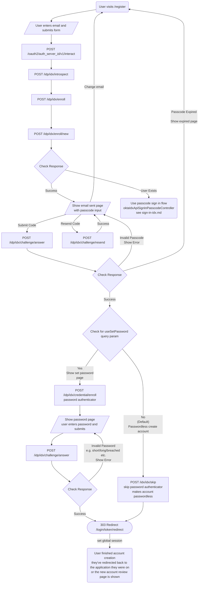

# Create Account flow with Okta IDX API

This document describes how the create account flow ([`/register`](https://profile.theguardian.com/register)) is implemented using the Okta IDX API.

See the [IDX API documentation](./idx-api.md) for more information on the API, e.g. to look up the specific endpoints and body used in the create account flow. The flowcharts below only show the expected success and error paths, if there are any unexpected errors, we fall back to the classic Okta API flow.

## User States

Currently the IDX API for users going through the create account journey is only implemented for new users. For existing users attempting to go through the registration flow we use the legacy Okta API for the time being in order to let the user know that they already have an account and can either reset their password or sign in. This is until we have UX consultation on how to handle existing users going through the registration flow.

| State            | Description                     | Action                                      |
| ---------------- | ------------------------------- | ------------------------------------------- |
| No existing user | The user does not exist in Okta | User is created using the IDX API           |
| Existing user    | The user exists in Okta         | User sent email saying their account exists |

## Flowchart

## Implementation

See the [`oktaIdxCreateAccount`](https://github.com/guardian/gateway/blob/bb8b32e30dd178a7ffe81ec75c64b2ce4ad93aeb/src/server/routes/register.ts#L319-L335) method for the implementation in code to send the user a passcode email for verification, this is called from the [`POST /register`](https://github.com/guardian/gateway/blob/bb8b32e30dd178a7ffe81ec75c64b2ce4ad93aeb/src/server/routes/register.ts#L108-L115) route.

The passcode submit route is [`POST /register/code`](https://github.com/guardian/gateway/blob/bb8b32e30dd178a7ffe81ec75c64b2ce4ad93aeb/src/server/routes/register.ts#L143-L145), and the route to resend the passcode is [`POST /register/code/resend`](https://github.com/guardian/gateway/blob/5211380b6cfbe2ad5bfe4f0d1aeed7a1ff831333/src/server/routes/register.ts#L244-L246).

### PRs

Here is a list of pull requests/issues relating to the create account flow with the Okta IDX API, probably not an exhaustive list:

- [#2567 - Initial (outdated) flowchart](https://github.com/guardian/gateway/issues/2567)
- [#2639 - Passcodes | Set up passcodes for registration](https://github.com/guardian/gateway/pull/2639)
- [#2671 - Passcodes | Add email template for RegistrationPasscode](https://github.com/guardian/gateway/pull/2671)
  - Additional PRs for email related issues
    - https://github.com/guardian/gateway/pull/2729
    - https://github.com/guardian/gateway/pull/2737
- [#2752 - Passcodes | Remove usePasscodeRegistration query parameter and make passcode registration default](https://github.com/guardian/gateway/pull/2752)
- [#2773 - Passcodes | Fix issues after round one of testing](https://github.com/guardian/gateway/pull/2773)
- [#2786 - Passcodes | Improve passcode styling/functionality](https://github.com/guardian/gateway/pull/2786)
- [Identity Platform - #806 - Okta | Make passwords optional](https://github.com/guardian/identity-platform/pull/806)
- [#3217 - Passwordless | Remove set password on account creation](https://github.com/guardian/gateway/pull/3127)
- [#3134 - Passwordless | Fix password optional double verification email](https://github.com/guardian/gateway/pull/3134)
