# Reset password flow with the Okta IDX API

This document describes how the reset (forgot) password flow ([`/reset-password`](https://profile.theguardian.com/reset-password)) is implemented using the Okta IDX API.

See the [IDX API documentation](./idx-api.md) for more information on the API, e.g. to look up the specific endpoints and body used in the create account flow. The flowcharts below only show the expected success and error paths, if there are any unexpected errors, we fall back to the classic Okta API flow where appropriate or show an error.

## User states

| Number | Internal Name           | State                                        | Description                                                                                                                                                                                                                                                         | Action                                                                                                                                                                                                                                                                                                                                                     |
| ------ | ----------------------- | -------------------------------------------- | ------------------------------------------------------------------------------------------------------------------------------------------------------------------------------------------------------------------------------------------------------------------- | ---------------------------------------------------------------------------------------------------------------------------------------------------------------------------------------------------------------------------------------------------------------------------------------------------------------------------------------------------------- |
| 1      | `ACTIVE_EMAIL_PASSWORD` | ACTIVE - "email" + "password" authenticators | Existing users, who have both the "email" and "password" authenticators when calling [`/identify`](./idx-api.md#identify)                                                                                                                                           | Use IDX [`/recover`](./idx-api.md#recover) flow to send passcode via email and set password via the IDX API                                                                                                                                                                                                                                                |
| 2      | `ACTIVE_EMAIL_ONLY`     | ACTIVE - "email" authenticator only          | Existing users, only "email" authenticator when calling [`/identify`](./idx-api.md#identify), so users who only sign in via a social provider, or don't have a password set (passwordless user)                                                                     | Set placeholder password for user to force them into above state, and then use IDX [`/recover`](./idx-api.md#recover) flow to send passcode via email and set password via the IDX API                                                                                                                                                                     |
| 3      | `ACTIVE_PASSWORD_ONLY`  | ACTIVE - "password" authenticator only       | Existing users, with only the "password" authenticator when calling [`/identify`](./idx-api.md#identify). User managed to set password (through the Okta Classic API flow) without verifying account with passcode (which would have set the "email" authenticator) | We need to set the "email" authenticator first before we allow them to change their password. See [`sendVerifyEmailAuthenticatorIdx` method](https://github.com/guardian/gateway/blob/bb8b32e30dd178a7ffe81ec75c64b2ce4ad93aeb/src/server/controllers/oktaIdxShared.ts#L24-L59) for full details and context.                                              |
| 4      | `NOT_ACTIVE`            | non-ACTIVE                                   | Existing users in any other state, e.g. STAGED/PROVISIONED etc.                                                                                                                                                                                                     | Force the user into an active state, easiest way to do this would be deactivating, then reactivating a user and setting a placeholder password. See [`forceUserIntoActiveState` method](https://github.com/guardian/gateway/blob/bb8b32e30dd178a7ffe81ec75c64b2ce4ad93aeb/src/server/controllers/oktaIdxShared.ts#L162-L184) for full details and context. |
| 5      | `NON_EXISTENT`          | No existing user                             | The user does not exist in Okta                                                                                                                                                                                                                                     | We show the passcode input email sent page when a user without account attempts to reset password, but send no email. Behaviour on passcode input page is the same as other cases, except submitting in passcode always results in "incorrect code" error                                                                                                  |

## Flowchart

```mermaid
flowchart TD
    start(User visits /reset-password)
    start --> enter-email[/User enters email and submits form/]
    enter-email --> get-user[GET /api/v1/users/:email]
    get-user --> get-user-check{Does user exist?}
    get-user-check -- No<br><br>Save NON_EXISTENT to state --> email-sent-passcode[/Show email sent page<br>with passcode input/]
    get-user-check -- Yes --> interact[POST /oauth2/auth_server_id/v1/interact]
    interact --> introspect[POST /idp/idx/introspect]
    introspect --> check-user-state{Check user state}
    check-user-state -- ACTIVE --> active-state-identify[POST /idp/idx/identify]
    check-user-state -- Non-ACTIVE --> non-active-state[Force user into active state<br>and get updated user]
    non-active-state --> interact
    active-state-identify --> active-state-identify-check{Check Response For Authenticators}
    active-state-identify-check -- email and password<br>authenticators<br><br>Save ACTIVE_EMAIL_PASSWORD to state --> active-email-password
    active-state-identify-check -- email only<br>authenticator --> active-email-only
    active-state-identify-check -- password only<br>authenticator<br><br>Save ACTIVE_PASSWORD_ONLY to state --> active-password-only
    active-email-password[POST /idp/idx/challenge<br>password authenticator] --> recover[POST /idp/idx/recover]
    recover --> recover-email-challenge[POST /idp/idx/challenge<br>email authenticator]
    recover-email-challenge --> email-sent-passcode
    active-email-only[Set placeholder password using dangerouslySetPlaceholderPassword<br>This puts user in ACTIVE_EMAIL_PASSWORD state] --> interact
    active-password-only[Use sendVerifyEmailAuthenticatorIdx to send<br>email authenticator verification email<br>see method for steps/details] --> email-sent-passcode
    email-sent-passcode -- Resend Code --> email-sent-passcode-resend[POST /idp/idx/challenge/resend]
    email-sent-passcode -- Change email --> start
    email-sent-passcode-resend --> email-sent-passcode
    email-sent-passcode -- Submit Code --> passcode-check{Check user status<br>from state}
    passcode-check -- NON_EXISTENT<br>Show incorrect code error --> email-sent-passcode
    passcode-check -- ACTIVE_EMAIL_PASSWORD or ACTIVE_PASSWORD_ONLY --> challenge-answer-passcode[POST /idp/idx/challenge/answer]
    challenge-answer-passcode --> challenge-answer-passcode-check{Check response}
    challenge-answer-passcode-check -- CompleteLoginResponse<br>Only users in ACTIVE_PASSWORD_ONLY will get this response --> classic-reset
    challenge-answer-passcode-check -- Set password response --> password-page[/Show password page<br>user enters password and submits/]
    classic-reset[Generate reset password token<br>using Okta Classic API] --> password-page
    password-page --> password-token-check{Check if using recover token}
    password-token-check -- Yes<br>This is for ACTIVE_PASSWORD_ONLY<br>users --> classic-reset-password
    password-token-check -- No<br>This is for ACTIVE_EMAIL_PASSWORD<br>users --> challenge-answer-password[POST /idp/idx/challenge/answer]
    challenge-answer-password --> challenge-answer-password-check{Check response}
    challenge-answer-password-check -- Success --> login-redirect([303 Redirect /login/token/redirect])
    challenge-answer-password-check -- Invalid Password<br>e.g. short/long/breached etc.<br>Show Error --> password-page
    login-redirect -- set global session --> finish
    classic-reset-password[User Okta Classic API to set password<br>using reset token] --> classic-reset-password-check{Check response}
    classic-reset-password-check -- Invalid Password<br>e.g. short/long/breached etc.<br>Show Error --> password-page
    classic-reset-password-check -- Success<br>Set session using existing flow --> finish
    finish(User finished resetting<br>they've redirected back to the application they were on<br>or password set page is shown)
```

## Implementation

See the [`changePasswordEmailIdx`](https://github.com/guardian/gateway/blob/bb8b32e30dd178a7ffe81ec75c64b2ce4ad93aeb/src/server/controllers/sendChangePasswordEmail.ts#L87-L98) method for the implementation in code to send the user a passcode email for reset password verification, this is called from the [`POST /reset-password`](https://github.com/guardian/gateway/blob/bb8b32e30dd178a7ffe81ec75c64b2ce4ad93aeb/src/server/routes/resetPassword.ts#L44-L46) and [`POST /reset-password/code/resend`](https://github.com/guardian/gateway/blob/bb8b32e30dd178a7ffe81ec75c64b2ce4ad93aeb/src/server/routes/resetPassword.ts#L303-L304) routes.

The passcode submit route is [`POST /reset-password/code`](https://github.com/guardian/gateway/blob/bb8b32e30dd178a7ffe81ec75c64b2ce4ad93aeb/src/server/routes/resetPassword.ts#L140-L142), and this will redirect to the password page if the user is in the correct state to set a password.

If the user is in the `ACTIVE_PASSWORD_ONLY` state the password page will be handled by the Okta Classic APIs, specifically [`checkTokenInOkta`](https://github.com/guardian/gateway/blob/bb8b32e30dd178a7ffe81ec75c64b2ce4ad93aeb/src/server/controllers/checkPasswordToken.ts#L197) method when loading the page and [`setPasswordController`](https://github.com/guardian/gateway/blob/bb8b32e30dd178a7ffe81ec75c64b2ce4ad93aeb/src/server/controllers/changePassword.ts#L128) when submitting the password.

If the user is in the `ACTIVE_EMAIL_PASSWORD` state, which would be for all other users, the password page will be handled by the IDX API, specifically [`oktaIdxApiCheckHandler`](https://github.com/guardian/gateway/blob/bb8b32e30dd178a7ffe81ec75c64b2ce4ad93aeb/src/server/controllers/checkPasswordToken.ts#L109-L126) method when loading the page and [`oktaIdxApiPasswordHandler`](https://github.com/guardian/gateway/blob/b6fd253d1ca0861186b9460d4b8de9362917fd84/src/server/controllers/changePassword.ts#L43-L60) when submitting the password.

Either way the user will automatically get signed in once the password is set, and redirected back to where they were before the reset password flow.

### PRs

Here is a list of pull requests/issues relating to the reset password flow with the Okta IDX API, probably not an exhaustive list:

- [#2833 - Passwordless | Add additional IDX API endpoints required](https://github.com/guardian/gateway/pull/2833)
- [#2835 - Passwordless | Add `EmailChallengePasscode` email and rendered route](https://github.com/guardian/gateway/pull/2835)
- [#2850 - Passwordless | Query parameter setup for Reset Password with passcodes](https://github.com/guardian/gateway/pull/2850)
- [#2851 - Passwordless | Passcode email sent page changes](https://github.com/guardian/gateway/pull/2851)
- [#2852 - Passwordless | Passcodes for reset password - ACTIVE users](https://github.com/guardian/gateway/pull/2852)
- [#2853 - Passwordless | Refactor and fix some Okta IDX API endpoints](https://github.com/guardian/gateway/pull/2853)
- [#2854 - Passwordless | Refactoring multiple Okta IDX API related things](https://github.com/guardian/gateway/pull/2854)
- [#2865 - Passwordless | Refactoring check/change password handlers](https://github.com/guardian/gateway/pull/2865)
- [#2866 - Passwordless | Update `PasswordUsed` page component + add routes](https://github.com/guardian/gateway/pull/2866)
- [#2881 - Passwordless | `ResetPasswordEmailSentPage` and API refactors](https://github.com/guardian/gateway/pull/2881)
- [#2889 - Passwordless | Passcodes for reset password - ACTIVE users with only "password" authenticator](https://github.com/guardian/gateway/pull/2889)
- [#2891 - Passwordless | YMIAR (Yet more IDX API Refactors)](https://github.com/guardian/gateway/pull/2891)
- [#2902 - Passwordless | Passcodes for reset password - non-ACTIVE users](https://github.com/guardian/gateway/pull/2902)
- [#2915 - Passwordless | Reset password with passcodes handle case for non-existent users](https://github.com/guardian/gateway/pull/2915)
- [#2916 - Passwordless | Make passcodes default for reset password flows](https://github.com/guardian/gateway/pull/2916)
