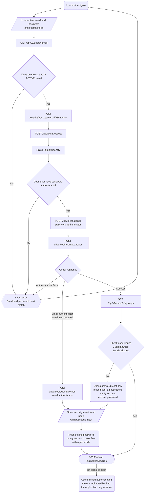
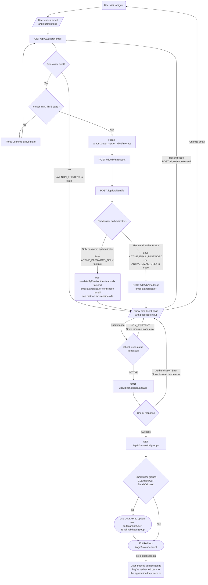

# Sign in flow with the Okta IDX API

This document describes how the sign in flow ([`/signin`](https://profile.theguardian.com/signin)) is implemented using the Okta IDX API.

This will be split into two parts, one for [sign in with a password](#sign-in-with-password), and the other for [sign in with a one-time passcode](#sign-in-with-one-time-passcode).

See the [IDX API documentation](./idx-api.md) for more information on the API, e.g. to look up the specific endpoints and body used in the sign in flow. The flowcharts below only show the expected success and error paths, if there are any unexpected errors, we fall back to the classic Okta API flow where appropriate or show an error.

## Sign in with password

Previously the sign in with password functionality used the classic [Okta Authentication API](https://developer.okta.com/docs/api/resources/authn) to implement this, specifically the [Primary authentication with public application](https://developer.okta.com/docs/reference/api/authn/#primary-authentication-with-public-applications) operation.

To match the new Interaction Code flow, we now use the Okta IDX API to implement the sign in with password functionality. From a user's perspective, the sign in flow is the same as before, they enter their email and password, and are redirected back to the application once authenticated, but the backend implementation is different.

### User States

| Number | Internal Name           | State                                        | Description                                                                                                                                                                                                                                                         | Action                                                                                                                                                                                                                                                                                                                                                     |
| ------ | ----------------------- | -------------------------------------------- | ------------------------------------------------------------------------------------------------------------------------------------------------------------------------------------------------------------------------------------------------------------------- | ---------------------------------------------------------------------------------------------------------------------------------------------------------------------------------------------------------------------------------------------------------------------------------------------------------------------------------------------------------- |
| 1      | `ACTIVE_EMAIL_PASSWORD` | ACTIVE - "email" + "password" authenticators | Existing users, who have both the "email" and "password" authenticators when calling [`/identify`](./idx-api.md#identify)                                                                                                                                           | Able to sign in with password using the IDX API. If the user isn't in the `GuardianUser-EmailValidated` group, then we effectively use the [reset password](./reset-password-idx.md#user-states) to validate their account and set a password securely                                                                                                     |
| 2      | `ACTIVE_EMAIL_ONLY`     | ACTIVE - "email" authenticator only          | Existing users, only "email" authenticator when calling [`/identify`](./idx-api.md#identify), so users who only sign in via a social provider, or don't have a password set (passwordless user)                                                                     | Since these users don't have a password, we just show the "Email and password don’t match" error                                                                                                                                                                                                                                                           |
| 3      | `ACTIVE_PASSWORD_ONLY`  | ACTIVE - "password" authenticator only       | Existing users, with only the "password" authenticator when calling [`/identify`](./idx-api.md#identify). User managed to set password (through the Okta Classic API flow) without verifying account with passcode (which would have set the "email" authenticator) | We authenticate using the IDX API, but before they can finish authentication we have to enroll the user in the "email" authenticator using an OTP, and have set a new password for these users, using how it works for these users in the [reset password](./reset-password-idx.md#user-states) flow to validate their account and set a password securely |
| 4      | `NOT_ACTIVE`            | non-ACTIVE                                   | Existing users in any other state, e.g. STAGED/PROVISIONED etc.                                                                                                                                                                                                     | Since these users don't have a password, we just show the "Email and password don't match" error                                                                                                                                                                                                                                                           |
| 5      | `NON_EXISTENT`          | No existing user                             | The user does not exist in Okta                                                                                                                                                                                                                                     | Since these users don't have an account, we just show the "Email and password don't match" error                                                                                                                                                                                                                                                           |

### Flowchart

Note: If the user is not in the `GuardianUser-EmailValidated` group, or if they only have the "password" authenticator and we need to enroll them in the "email" authenticator, then we need to validate their email and set a password securely. This functionality effectively uses the [reset password](./reset-password-idx.md) flow to do this. This could be changed in the future to only require the user to validate their email without needing to set a password, specifically when passwordless is enabled and users don't need to have a password set when using a non social provider flow.

### Implementation

See the [`oktaIdxApiSignInController` method](https://github.com/guardian/gateway/blob/bb8b32e30dd178a7ffe81ec75c64b2ce4ad93aeb/src/server/controllers/signInControllers.ts#L368-L382) when the user submits the sign in form using the [`POST /signin` route](https://github.com/guardian/gateway/blob/bb8b32e30dd178a7ffe81ec75c64b2ce4ad93aeb/src/server/routes/signIn.ts#L254-L255), but not using passcodes (determined by the `passcode` body parameter not being present/defined).

### PRs

Here's a list of PRs/Issues that are related to the sign in with password flow with the Okta IDX API. This may not be conclusive:

- [#2926 - Passwordless | Use IDX API for Sign In With Password](https://github.com/guardian/gateway/pull/2926)
- [#2931 - Passwordless | Make IDX API default for sign in with password flows!](https://github.com/guardian/gateway/pull/2931)

## Sign in with one-time passcodes

Using the IDX API and the Interaction Code flow, we can implement sign in with one-time passcodes (OTPs) for all users to attempt to sign in without a password. This exists alongside the sign in with password flow, and the user is given the option to sign in with a password or a one-time passcode.

### User States

| Number | Internal Name           | State                                        | Description                                                                                                               | Action                                                                                                                                                                                                                                                                                                                                                                                                                                                                                                                                   |
| ------ | ----------------------- | -------------------------------------------- | ------------------------------------------------------------------------------------------------------------------------- | ---------------------------------------------------------------------------------------------------------------------------------------------------------------------------------------------------------------------------------------------------------------------------------------------------------------------------------------------------------------------------------------------------------------------------------------------------------------------------------------------------------------------------------------- |
| 1      | `ACTIVE_EMAIL_PASSWORD` | ACTIVE - "email" + "password" authenticators | Existing users, who have both the "email" and "password" authenticators when calling [`/identify`](./idx-api.md#identify) | Able to send the user an OTP to sign in with using the IDX API as they have the "email" authenticator                                                                                                                                                                                                                                                                                                                                                                                                                                    |
| 2      | `ACTIVE_EMAIL_ONLY`     | ACTIVE - "email" authenticator only          | Existing users, only "email" authenticator when calling [`/identify`](./idx-api.md#identify)                              | Able to send the user an OTP to sign in with using the IDX API as they have the "email" authenticator                                                                                                                                                                                                                                                                                                                                                                                                                                    |
| 3      | `ACTIVE_PASSWORD_ONLY`  | ACTIVE - "password" authenticator only       | Existing users, with only the "password" authenticator when calling [`/identify`](./idx-api.md#identify)                  | Can't send OTP straight away to sign in user. We have to enroll the user into the "email" authenticator. We do this by setting a placeholder password, and then sending the user a "email" authenticator verification email with a OTP. When the user uses the passcode we sign them in (no need to set a new password). See [`sendVerifyEmailAuthenticatorIdx` method](https://github.com/guardian/gateway/blob/bb8b32e30dd178a7ffe81ec75c64b2ce4ad93aeb/src/server/controllers/oktaIdxShared.ts#L24-L59) for full details and context. |
| 4      | `NOT_ACTIVE`            | non-ACTIVE                                   | Existing users in any other state, e.g. STAGED/PROVISIONED etc.                                                           | Force the user into an active state, easiest way to do this would be deactivating, then reactivating a user and setting a placeholder password. See [`forceUserIntoActiveState` method](https://github.com/guardian/gateway/blob/bb8b32e30dd178a7ffe81ec75c64b2ce4ad93aeb/src/server/controllers/oktaIdxShared.ts#L162-L184) for full details and context. Once in `ACTIVE` state, then take once of the `ACTIVE` actions.                                                                                                               |
| 5      | `NON_EXISTENT`          | No existing user                             | The user does not exist in Okta                                                                                           | We show the passcode input email sent page when a user without account attempts to sign in with a passcode, but send no email. Behaviour on passcode input page is the same as other cases, except submitting in passcode always results in "incorrect code" error                                                                                                                                                                                                                                                                       |

### Flowchart

### Implementation

See the [`oktaIdxApiSignInPasscodeController`](https://github.com/guardian/gateway/blob/bb8b32e30dd178a7ffe81ec75c64b2ce4ad93aeb/src/server/controllers/signInControllers.ts#L175-L182) method for the implementation in code to send the user a one-time passcode via email to sign in with. This happens when the user submits the sign in form using the [`POST /signin` route](https://github.com/guardian/gateway/blob/bb8b32e30dd178a7ffe81ec75c64b2ce4ad93aeb/src/server/routes/signIn.ts#L254-L255), but using passcodes (determined by the `passcode` body parameter being present/defined).

The passcode submit route is [`POST /signin/code`](https://github.com/guardian/gateway/blob/bb8b32e30dd178a7ffe81ec75c64b2ce4ad93aeb/src/server/routes/signIn.ts#L309-L313), which uses the [`oktaIdxApiSubmitPasscodeController`](https://github.com/guardian/gateway/blob/bb8b32e30dd178a7ffe81ec75c64b2ce4ad93aeb/src/server/controllers/signInControllers.ts#L602-L610) method to verify the passcode and finish the sign in process.

### PRs

Here's a list of PRs/Issues that are related to the sign in with one-time passcodes flow with the Okta IDX API. This may not be conclusive:

- [#2943 - Passwordless | Refactors/Fixes before sign in with passcodes](https://github.com/guardian/gateway/pull/2943)
- [#2942 - Passwordless | Sign in with passcodes](https://github.com/guardian/gateway/pull/2942)
