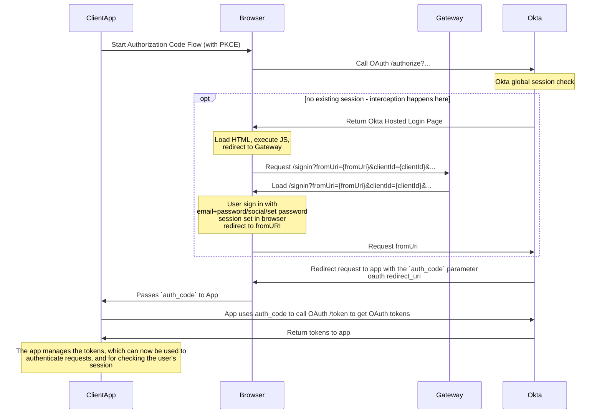

# Okta Hosted Login Interception

When performing the OAuth Authorization Code flow with Okta, while navigating to the `/authorize` endpoint Okta will check if the user has an existing session.

If they do, then the user will be redirected back to the client app with the `authorization_code` parameter, and the SDK will then exchange this for the OAuth tokens.

If they don't then the user will be prompted to sign in/authenticate. However this is done by Okta showing their own hosted login page, which has a lack of customisation options, and it doesn't provide us full control over the user experience, or doesn't allow us to do specific things during the process.

Examples of things we currently do that we can't do with the Okta hosted login page:

- On login if the user has not validated their email or has a weak password, we can block them from logging in and asking them to verify their email and set a stronger password.
- Set any Guardian specific cookies that are required for the user, e.g. legacy Identity cookies, ad-free cookie.
- Perform remediation work, e.g. getting social users into the correct group/state after registration
- Including a custom "onboarding" process after registration.

By default Okta doesn't allow us to use our own login page, but they do allow us to customise the HTML and JavaScript of their hosted login page. Using this we can intercept when the Okta hosted login page is loaded, and using some JavaScript we can redirect the user to our own login page on Gateway. We can then use our flows to authenticate the user, and when they do we can then redirect the user back to Okta in order to complete the Authorization Code Flow.

## How the interception works

We customise the Okta hosted login page to not load the sign in widget, but instead redirect the user to our own login page. Luckily through the Okta dashboard we're able to customise the HTML, and in turn the JavaScript that is loaded.

From the Okta hosted login page we need to pass the following parameters to our own login page:

- **`fromURI`**: This is the URI to redirect to after the user has logged in and has a session set to complete the Authorization Code Flow from the SDK.
- **`clientId`**: This is the client ID of the application that is calling the SDK and in turn performing the Authorization Code Flow. This parameter can be used to customise the experience our pages.

In the SDK we're also able to pass additional parameters, which we can use to pass the `activation_token` from the user's email link. This can then be used to direct the user to the create password/welcome page instead of the login page, and complete the authorization code flow from there.

The custom javascript for this can be seen in [`scripts/okta/okta-login.ts`](../../scripts/okta/okta-login.ts). And the custom HTML can be seen in [`scripts/okta/okta-login.html`](../../scripts/okta/okta-login.html).

The code is rendered in the Okta hosted sign in page at `/login/login.htm` or even at `/oauth2/<authorization server id>/v1/authorize` depending on what Okta feels like on the day (essentially we don't know when Okta decides to use, but it seems the latter is becoming more common in Okta Identity Engine).

We get the `fromURI` and `clientId` from the javascript in the hosted sign in page, which are passed in by Okta using parameters from the SDK.

If these exist, then we can redirect the user to the Gateway sign in page which will persist the `fromURI` through the login process, and redirect the user back to the callback uri supplied to the app with the `authorization_code` the Okta SDK should then finish as normal.

The general steps for the interception are shown in this high level diagram:



## Customising the interception code

All the code for the interception is in the [`scripts/okta`](../../scripts/okta) folder with the following structure:

```
scripts/okta
├── __tests__                           # Tests for the interception code
│   ├─── getClientId.test.ts
│   ├─── getMaxAge.test.ts
│   ├─── getRedirectUrl.test.ts
│   ├─── getRelayState.test.ts
│   ├─── getThirdPartyClientId.test.ts
│   └─── getThirdPartyReturnUrl.test.ts
├── lib
│   └─── helper.ts                      # Main helper functions for the interception code
├── login-default.html                  # Default HTML for the Okta hosted login page, used in case we need to reset the custom HTML
├── okta-login.html                     # The custom HTML for the Okta hosted login page, which includes the interception code
├── okta-login.ts                       # The custom TypeScript file which is compiled to the okta-login.js file
├── okta-login.js                       # The compiled JavaScript file which is used in the Okta hosted login page
├── tsconfig.json                       # The TypeScript config for compiling the okta-login.ts file
├── webpack.config.js                   # The Webpack config for compiling the okta-login.ts file
└── window.d.ts                         # The TypeScript definition file for the window object
```

The interception code is written in TypeScript, and is compiled to JavaScript using Webpack. The compiled JavaScript file is then used in the Okta hosted login page.

````

For development the first place to start is `okta-login.ts` where the interception code is written. The code is written in TypeScript, and the main functions are in the `lib/helper.ts` file which are imported into the `okta-login.ts` file.


We use jsdelivr to load this script, the automatic minification reduces the size.

```html
<script src="https://cdn.jsdelivr.net/gh/guardian/gateway@main/scripts/okta/okta-login.min.js"></script>
````

If testing out changes for a particular branch you can change the branch it's looking for in the custom HTML itself.

e.g. for a branch called `feature-branch-xyz`:

```html
<script src="https://cdn.jsdelivr.net/gh/guardian/gateway@feature-branch-xyz/scripts/okta/okta-login.min.js"></script>
```

or commit

```html
<script src="https://cdn.jsdelivr.net/gh/guardian/gateway@df4557838d25ab7991130acc4cbe92e6ab063e6d/scripts/okta/okta-login.min.js"></script>
```

If you make changes to these files, be sure to run `yarn gen:okta-login` to compile the TypeScript and generate the Javascript file, `okta-login.js`.
Then be sure to commit the updated Javascript file in order to use it with jsdelivr.

By writing these files in TypeScript, we can use modern syntax and features, and have the code compiled to ES5 JavaScript. It also allows us to use Jest to test this code, which will run as part of the CI pipeline, or manually using `yarn test` or `yarn test:unit`.

When modifying these files, be sure to code defensively, as we want to handle any errors or unexpected flows that may occur.

The Okta hosted sign in page doesn't have just one url which it executes on.

We've noticed the following two urls (paths):

- `/login/login.htm`
- `/oauth2/<authorization server id>/v1/authorize`

Each will have a different query string and different config objects which are handled as appropriate in `helper.ts`.

Okta Identity Engine now uses JS redirects instead of HTTP redirects.

This has the consequence that Social Sign In requires the SDK and widget to be loaded on the page in order to authenticate.

However we only want to do this in the case of Social Sign In, as we want to use our own custom login page for other flows.

So we check for the `idp` query param, which is only present in the case of Social Sign In or the callback path for Social Sign In.

If present, we load the SDK and widget to handle social sign in, otherwise we redirect to our custom login page.

## Deployment

It's not possible to terraform the Okta hosted login page, so we have to manually update the HTML and JavaScript in the Okta dashboard.

From the dashboard this is under "Customization" > "Brands" > "The Guardian - [STAGE]", and the one with the custom domain. Then under the "Pages" tab, and the "Configure" button for the "Sign-in Page". From there you can edit the HTML and JavaScript.
