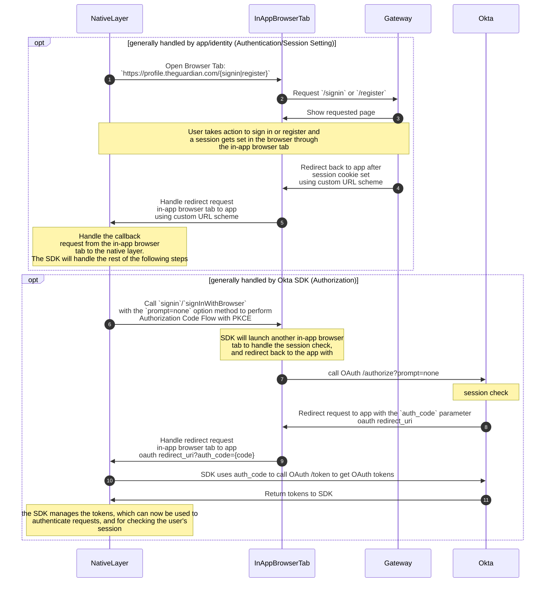
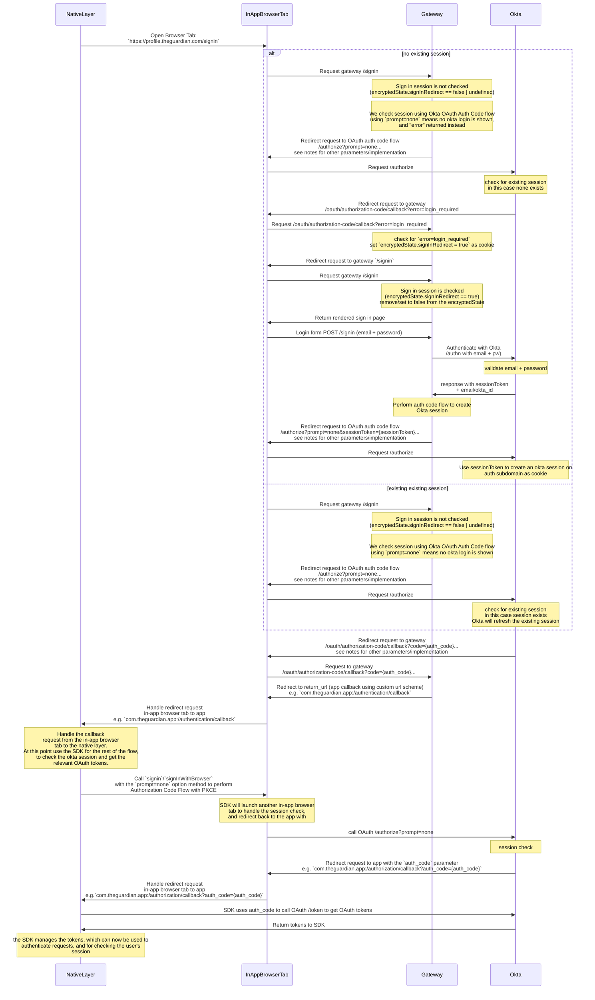
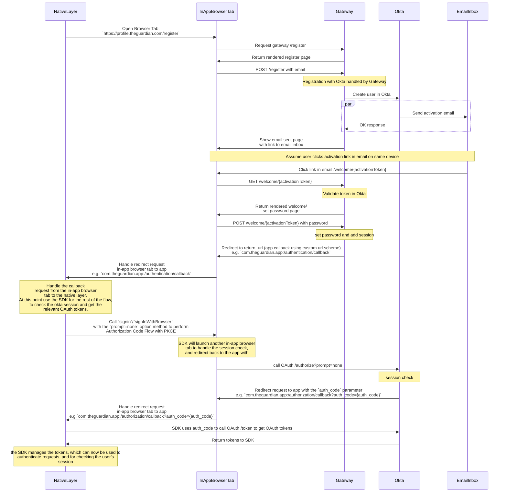

# Native apps integration with Okta

## Authentication

The approach for both sign in and registration in native apps uses the Okta SDK along with a in-app browser tab (iOS: `SFSafariViewController`/`SFAuthenticationSession`, Android: `CustomTabsService` (Custom Tab)). First use the in-app browser tab to authenticate against the identity sign in and registration pages and get an Okta session cookie set in the user's browser. At the end of this process we redirect back into the application, and use the Okta SDK `signin`/`signInWithBrowser` with the `prompt=none` option to get the OAuth tokens, specifically the `id_token`, `access_token` and `refresh_token`. Once the tokens are received, checking the validity of these tokens is enough to check if the user is signed in, instead of having to perform the full login flow again.

See [RFC 8252: OAuth 2.0 for Mobile and Native Apps](https://datatracker.ietf.org/doc/html/rfc8252) for the full recommendations. Specifically, the [Platform-Specific Implementation Details](https://datatracker.ietf.org/doc/html/rfc8252#appendix-B) section of the RFC describes the best practices for each platform - [iOS](https://datatracker.ietf.org/doc/html/rfc8252#appendix-B.1), [Android](https://datatracker.ietf.org/doc/html/rfc8252#appendix-B.2).

To hand control back to the App Native layer from the In-App Browser Tab we recommend [private-use URI scheme](https://datatracker.ietf.org/doc/html/rfc8252#section-7.1) (referred to as "custom URL scheme") redirects and [claimed "https" scheme URIs](https://datatracker.ietf.org/doc/html/rfc8252#section-7.2) (known as "Universal Links"). From our testing and POC implementation, we found that "custom URL schemes" worked better for redirects from the "in-app browser tab", however using this approach we should be careful not to send any identifiable information to the redirect URL, and when handling the redirect not to take any action with an unindented side effect.

The general steps for native apps integration are shown in this high level diagram:

## Setup

To setup a native app, we will need to register the application as an client within Okta. The identity team will be able to do this for you. We will need to know 3 things, all do do with redirects.

1. A redirect URI for redirection from sign in and registration pages (authentication).
   - This is the URI that the native app will be redirected to after a user signs in or registers on the profile subdomain and gets a session cookie set in the browser.
   - This callback should be used to call the Okta SDK `signin`/`signInWithBrowser` with the `prompt=none` option to get the OAuth tokens, specifically the `id_token`, `access_token` and `refresh_token`.
   - We suggest a custom URL scheme for this URI, which we can identify (`your-app:/authentication/callback`).
   - e.g. `com.theguardian.app:/authentication/callback`
2. A redirect callback URI for Okta authorization callback
   - This is used by the Okta SDK to redirect back to after performing the authorization code flow with PKCE used to get OAuth tokens if a session is set.
   - Similar to above we suggest a custom URL scheme for this URI, which we can identify (`your-app:/authorization/callback`).
   - e.g. `com.theguardian.app:/authorization/callback`
3. A redirect callback URI for Okta logout callback
   - This is used by the Okta SDK to redirect back to after calling the logout method in the SDK.
   - Similar to above we suggest a custom URL scheme for this URI, which we can identify (`your-app:/logout/callback`).
   - e.g. `com.theguardian.app:/logout/callback`

No 1. will have to be handled by the native app itself by registering the custom url scheme.

No 2. will be handled by the Okta SDK.

No 3. may have to be handled by the application rather than the Okta SDK to handle post logout clean up.

We will need a set for the PROD, CODE, and possibly DEV environments.

Once the app is set up within Okta and this project. The Identity team will give you the following information to configure the Okta SDK:

| Name                | Key                                            | Explanation                                                                                                                                                                                                       | Example                                                                           |
| ------------------- | ---------------------------------------------- | ----------------------------------------------------------------------------------------------------------------------------------------------------------------------------------------------------------------- | --------------------------------------------------------------------------------- |
| Client ID           | `client_id`/`clientId`                         | The client ID from the app integration that was created                                                                                                                                                           | `0ux3rutxocxFX9xyz3t9`                                                            |
| Issuer              | `discovery_uri`/`issuer`                       | Domain of the Okta app, followed by the OAuth authorization server. We use a custom authorization server rather than the default one as it lets us customise lifetimes of tokens                                  | `https://profile.theguardian.com/oauth2/aus2qtyn7pS1YsVLs0x7`                     |
| Logout Redirect URI | `end_session_redirect_uri`/`logoutRedirectUri` | The post-logout redirect URI from the app integration that was created                                                                                                                                            | `com.theguardian.app:/logout/callback`                                            |
| Redirect URI        | `redirect_uri`/`redirectUri`                   | The Redirect URI from the app integration that was created                                                                                                                                                        | `com.theguardian.app:/authorization/callback`                                     |
| Scopes              | `scopes`                                       | Default permissions for the OAuth tokens, you'll want `openid profile offline_access` at the minimum. Information about the scopes can be seen [here](https://developer.okta.com/docs/reference/api/oidc/#scopes) | `openid profile offline_access` or json `["openid", "profile", "offline_access"]` |

## Full sign in diagram

Much of the following is adopted from [signin.md](signin.md), with changes to fit the native apps implementation. Apps should only need to be aware of what's happening in the native layer, but the full flow is useful for understanding the interaction between the native layer and the identity system. User interaction is implied.

## Full registration diagram

Similar to sign in, much of the following is adopted from [registration.md](registration.md), with changes to fit the native apps implementation. Apps should only need to be aware of what's happening in the native layer, but the full flow is useful for understanding the interaction between the native layer and the identity system. User interaction is implied.

// TODO: Add full registration document/details

