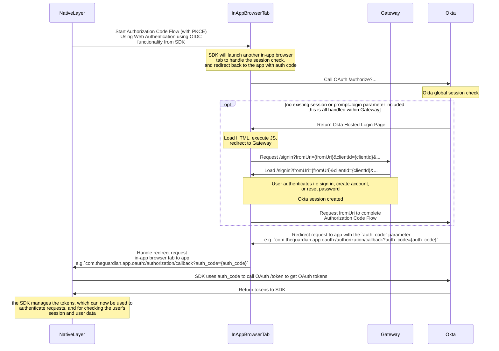

# Native apps integration with Okta

See [RFC 8252: OAuth 2.0 for Mobile and Native Apps](https://datatracker.ietf.org/doc/html/rfc8252) for the full recommendations. Specifically, the [Platform-Specific Implementation Details](https://datatracker.ietf.org/doc/html/rfc8252#appendix-B) section of the RFC describes the best practices for each platform - [iOS](https://datatracker.ietf.org/doc/html/rfc8252#appendix-B.1), [Android](https://datatracker.ietf.org/doc/html/rfc8252#appendix-B.2).

To hand control back to the App Native layer from the In-App Browser Tab we recommend [private-use URI scheme](https://datatracker.ietf.org/doc/html/rfc8252#section-7.1) (referred to as "custom URL scheme") redirects and [claimed "https" scheme URIs](https://datatracker.ietf.org/doc/html/rfc8252#section-7.2) (known as "Universal Links"). From our testing and POC implementation, we found that "custom URL schemes" worked better for redirects from the "in-app browser tab", however using this approach we should be careful not to send any identifiable information to the redirect URL, and when handling the redirect not to take any action with an unindented side effect.

However the below should be enough to implement the flows.

## Auth(entication/orization) Flow

### Introduction

For authorizing users in native apps, the best current practice is to perform the OAuth authorization request in an external user-agent (typically the browser) rather than an embedded user-agent (such as one implemented with web-views).

Previously, it was common for native apps to use embedded user-agents (commonly implemented with web-views) for OAuth authorization requests. That approach has many drawbacks, including the host app being able to copy user credentials and cookies as well as the user needing to authenticate from scratch in each app. See [Section 8.12 of the RFC 8252](https://datatracker.ietf.org/doc/html/rfc8252#section-8.12) for a deeper analysis of the drawbacks of using embedded user-agents for OAuth.

Native app authorization requests that use the browser are more secure and can take advantage of the user's authentication state. Being able to use the existing authentication session in the browser enables single sign-on, as users don't need to authenticate to the authorization server each time they use a new app (unless required by the authorization server policy).

### Implementation

The approach for authentication in native apps uses the Okta SDK methods to launch the authentication flow and handle the OAuth2/OIDC flow. From the Identity side, the call to the Okta own login page is intercepted and we redirect to our own login page with the parameters provided from the Okta hosted sign in page.

We recommend using an SDK to implement the authentication flow:

- Android
  - [Okta Mobile SDK for Kotlin](https://github.com/okta/okta-mobile-kotlin)
  - _legacy: [Okta OIDC Android SDK](https://github.com/okta/okta-oidc-android)_
- iOS
  - [Okta Mobile SDK for Swift](https://github.com/okta/okta-mobile-swift)
  - _legacy: [Okta OIDC iOS SDK](https://github.com/okta/okta-oidc-ios)_

To initiate authentication the app will use the SDK to call the relevant method to start web authentication using OpenID Connect redirect. In Kotlin SDK see [here](https://github.com/okta/okta-mobile-kotlin?tab=readme-ov-file#web-authentication-using-oidc-redirect) and in Swift SDK see [here](https://github.com/okta/okta-mobile-swift?tab=readme-ov-file#web-authentication-using-oidc) for information on web authentication. The SDK uses the functionality to launch the Authorization Code Flow with PKCE in a web browser.

It will launch an in-app browser tab (iOS: `ASWebAuthenticationSession`, Android: `CustomTabsService` (Custom Tab)) to check if a user session exists in Okta. In **_all_** cases you will want to pass the `prompt=login` parameter to the SDK to ensure that the user is shown the sign in page regardless of if they have an existing session or not.

If a user session exists, Okta will redirect back to the app with an authorization code. The app will then use the SDK to exchange the authorization code for any tokens, usually the `id_token`, `access_token` and `refresh_token`. These tokens are stored in the SDK and can be used to authenticate the user, and authorize the app to access other resources. Once the tokens are received, checking the validity of these tokens is enough to check if the use is signed in, instead of having to perform the full login flow again. See the [token](./oauth.md#oauthoidc-tokens-claims-and-scopes) documentation for more information on the differences between the tokens.

If no user session exists, Okta will attempt to show it's own login page. When the browser attempts to load this page, we perform a JavaScript redirect to our own login page instead with any parameters that are required to complete the Authorization Code flow in the Native App. At this point the user can navigate between sign in and registration.

If the user signs in successfully, a session cookie will be set in the browser, and we complete sign in by redirecting the user back to the `fromURI` parameter. This will redirect the user to Okta, which will then redirect the user back to the app with the authorization code, and as above this is exchanged for tokens.

The flow now supports sign in, create account, and reset password in a single browser flow thanks to the work done to implement passcodes for create account and reset password so the user doesn't have to rely on clicking on a link.

## Setup

To setup a native app, we will need to register the application as an client within Okta. The identity team will be able to do this for you. We will need to know 3 things, all do do with redirects.

1. A redirect callback URI for Okta authorization callback
   - This is used by the Okta SDK to redirect back to after performing the authorization code flow with PKCE used to get OAuth tokens if a session is set.
   - Similar to above we suggest a custom URL scheme for this URI, which we can identify (`your-app:/authorization/callback`).
   - e.g. `com.theguardian.app.oauth:/authorization/callback`
2. A redirect callback URI for Okta logout callback
   - This is used by the Okta SDK to redirect back to after calling the logout method in the SDK.
   - Similar to above we suggest a custom URL scheme for this URI, which we can identify (`your-app:/logout/callback`).
   - e.g. `com.theguardian.app.oauth:/logout/callback`
   - Optional

No 1. will be handled by the Okta SDK.

No 2. may have to be handled by the application rather than the Okta SDK to handle post logout clean up.

We will need a set for the PROD, CODE, and possibly DEV environments.

Once the app is set up within Okta and this project. The Identity team will give you the following information to configure the Okta SDK:

| Name                | Key                                            | Required | Explanation                                                                                                                                                                                                       | Example                                                                           |
| ------------------- | ---------------------------------------------- | -------- | ----------------------------------------------------------------------------------------------------------------------------------------------------------------------------------------------------------------- | --------------------------------------------------------------------------------- |
| Client ID           | `client_id`/`clientId`                         | Yes      | The client ID from the app integration that was created                                                                                                                                                           | `0ux3rutxocxFX9xyz3t9`                                                            |
| Issuer              | `discovery_uri`/`issuer`                       | Yes      | Domain of the Okta app, followed by the OAuth authorization server. We use a custom authorization server rather than the default one as it lets us customise lifetimes of tokens                                  | `https://profile.theguardian.com/oauth2/aus2qtyn7pS1YsVLs0x7`                     |
| Redirect URI        | `redirect_uri`/`redirectUri`                   | Yes      | The Redirect URI from the app integration that was created                                                                                                                                                        | `com.theguardian.app.oauth:/authorization/callback`                               |
| Scopes              | `scopes`                                       | Yes      | Default permissions for the OAuth tokens, you'll want `openid profile offline_access` at the minimum. Information about the scopes can be seen [here](https://developer.okta.com/docs/reference/api/oidc/#scopes) | `openid profile offline_access` or json `["openid", "profile", "offline_access"]` |
| Logout Redirect URI | `end_session_redirect_uri`/`logoutRedirectUri` | Optional | The post-logout redirect URI from the app integration that was created                                                                                                                                            | `com.theguardian.app.oauth:/logout/callback`                                      |

The relevant `.well-known` files to be able to handle these redirects within the app.

## Diagrams

The following shows the behaviour in perspective from the app (NativeLayer), for more specific details on how the [sign in](./idx/sign-in-idx.md), [create account](./idx/create-account-idx.md), or [reset password](./idx/reset-password-idx.md) flows work see the relevant documentation.

The app only needs to pay attention to what's happening on the NativeLayer.

## FAQs

- **How long are the tokens valid for?**
  - Speak to the Identity team about this as this is configurable, but for native apps we set the `access_token` and `id_token` in the apps are valid for 24 hours, and the refresh token is valid for 1 year, but will expire if not used for 6 months.
- **When/how do I refresh the tokens?**
  - We suggest checking the validity of the tokens before using them internally or making a request to the API.
  - If the token is expired, you should use the refresh token to get a new access token and id token.
  - If the refresh token is expired, you should sign the user out
  - The best time to check and refresh the tokens is when the app is opened, or before making a request to an API that required an access token/
- **How do I sign the user out?**
  - While the app has methods to sign the user out, we recommend implementing a sign out method that should be used instead.
  - This is because the SDK sign out method will use the browser to invalidate the users okta session, but we don't want to do this as we want to keep the session alive for other apps for SSO purposes. It also causes issues with other applications that may be using the same session.
  - Instead we recommend using the Okta SDK to simply revoke the tokens using the `revoke` method, and then clearing the tokens from the storage.
  - This will ensure that the tokens are invalidated and removed from the app, and the user will be signed out of the app only
- **How do I check if the user is signed in?**
  - You can also use the `isAuthenticated` method to check if the user is signed in or not.
- **How do I get the user information?**
  - User data to use within the application is stored in the `id_token`, the SDK should have methods to decode the token and get the user information.
  - If you need additional information in the token that is not currently available, please speak to the Identity team about this. You may need an additional scope, or the identity team may need to make configuration changes in order to add the information to the token
- **Any other questions?**
  - Please speak to the Identity team about any other questions you may have, or if you need help with implementing the flow.
  - We can then also update this documentation with any additional information that may be useful to others!
