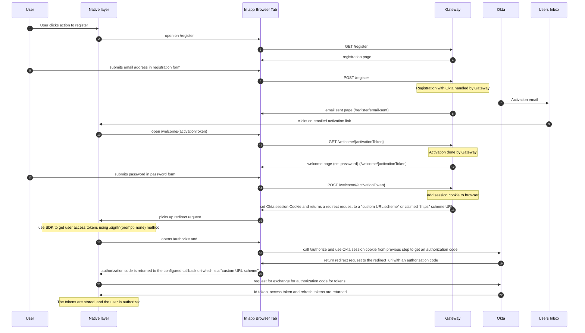

### Apps registration with Okta

The approach for registration in native apps uses the Okta SDK along with a in-app browser tab for displaying the registration web page.

See https://www.rfc-editor.org/rfc/rfc8252.txt#:~:text=See%20Section%208.1-,Appendix%20B.%20%20Platform%2DSpecific%20Implementation%20Details,-This%20document%20primarily for recommendations for iOS ("SFAuthenticationSession") and Android (Android Custom Tab)

To hand control back to the App Native layer from the In-App Browser Tab, private-use URI scheme (referred to as "custom URL scheme") redirects and claimed "https" scheme URIs (known as "Universal Links")

The main steps for the user in the registration process are as follows:

1. Enters their email address to register with (step 5 in diagram)
2. They are sent an activation email (step 11 in diagram)
3. They click the activation link within the email (step 13 in diagram)
4. This link opens a in-app browser tab in the native app again (step 14 in diagram)
5. The User enters their password and submits the form (step 19)
6. The User is taken out of the in-app browser tab and is signed in to the native app (step 25)

# Diagram

