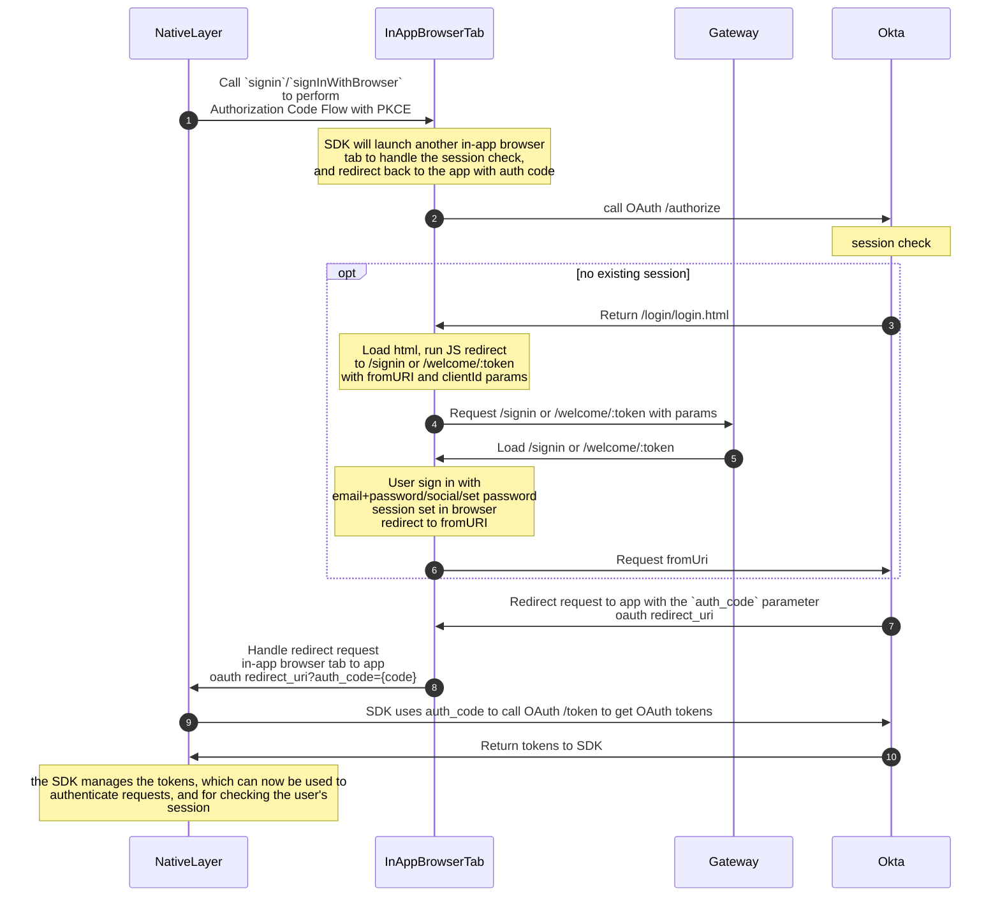
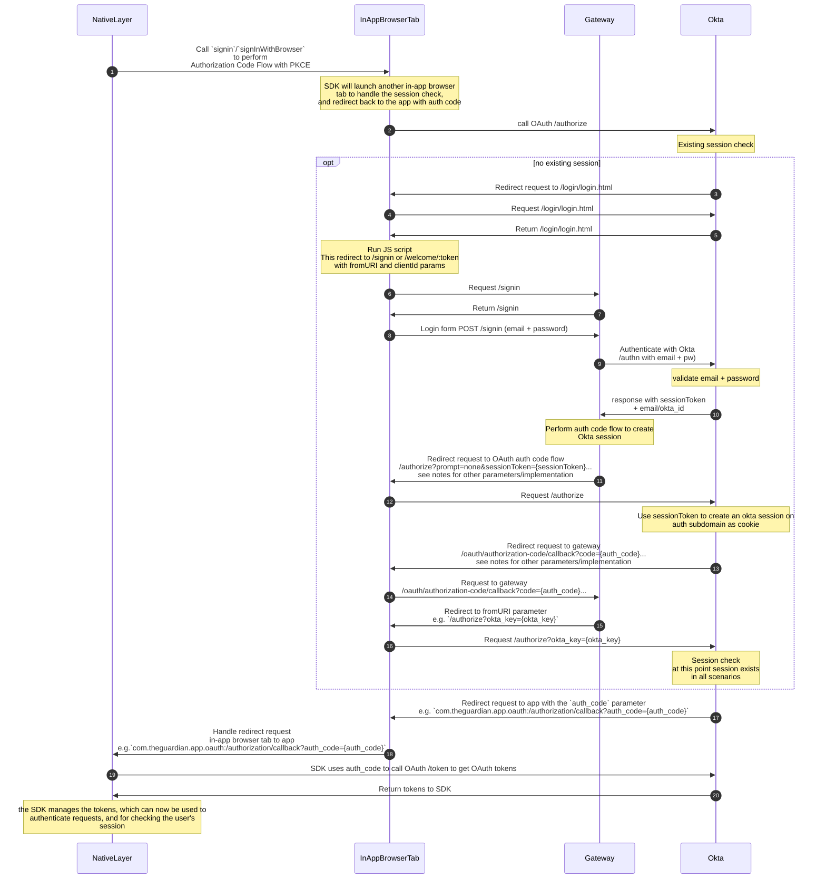
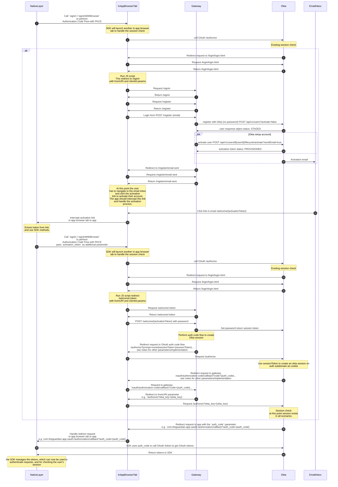
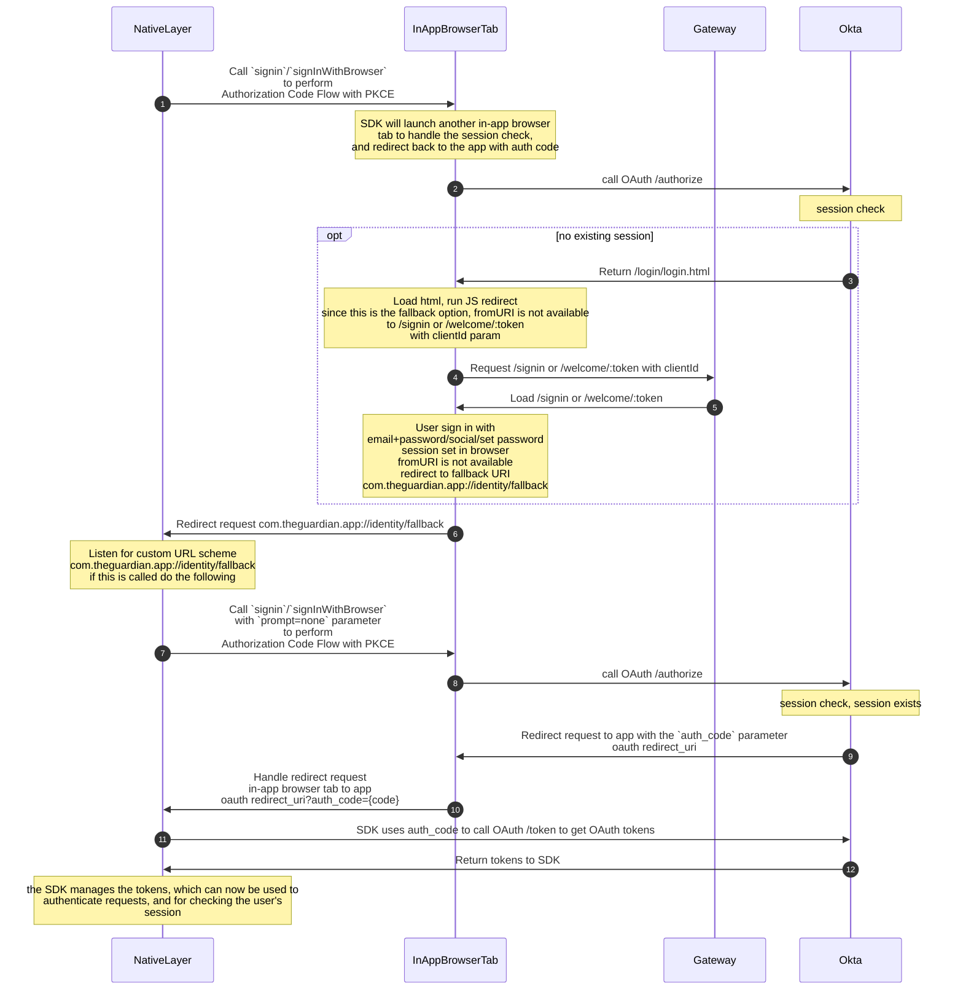

# Native apps integration with Okta

See [RFC 8252: OAuth 2.0 for Mobile and Native Apps](https://datatracker.ietf.org/doc/html/rfc8252) for the full recommendations. Specifically, the [Platform-Specific Implementation Details](https://datatracker.ietf.org/doc/html/rfc8252#appendix-B) section of the RFC describes the best practices for each platform - [iOS](https://datatracker.ietf.org/doc/html/rfc8252#appendix-B.1), [Android](https://datatracker.ietf.org/doc/html/rfc8252#appendix-B.2).

To hand control back to the App Native layer from the In-App Browser Tab we recommend [private-use URI scheme](https://datatracker.ietf.org/doc/html/rfc8252#section-7.1) (referred to as "custom URL scheme") redirects and [claimed "https" scheme URIs](https://datatracker.ietf.org/doc/html/rfc8252#section-7.2) (known as "Universal Links"). From our testing and POC implementation, we found that "custom URL schemes" worked better for redirects from the "in-app browser tab", however using this approach we should be careful not to send any identifiable information to the redirect URL, and when handling the redirect not to take any action with an unindented side effect.

However the below should be enough to implement the flows.

## Authentication (Sign in and Registration)

The approach for both sign in and registration in native apps uses the Okta SDK methods to launch the authentication flow and handle the OAuth2/OIDC flow. From the Identity side, the call to the Okta own login page is intercepted and we redirect to our own login page with the parameters provided from the Okta hosted sign in page.

The SDKs we're using are the [Okta OIDC iOS SDK](https://github.com/okta/okta-oidc-ios) and [Okta OIDC Android SDK](https://github.com/okta/okta-oidc-android).

To initiate login or registration the app with use the SDK to call the relevant method. In Android this is done by calling `.signIn(...)` and in iOS by calling `.signInWithBrowser(...)`, without any additional parameters. The SDK uses this method to launch the Authorization Code Flow with PKCE. It will launch an in-app browser tab (iOS: `ASWebAuthenticationSession`, Android: `CustomTabsService` (Custom Tab)) to check if a user session exists in Okta.

If a user session exists, Okta will redirect back to the app with an authorization code. The app will then use the SDK to exchange the authorization code for any tokens, usually the `id_token`, `access_token` and `refresh_token`. These tokens are stored in the SDK and can be used to authenticate the user, and authorize the app to access other resources. Once the tokens are received, checking the validity of these tokens is enough to check if the use is signed in, instead of having to perform the full login flow again.

If no user session exists, Okta will attempt to show it's own login page. When the browser attempts to load this page, we perform a JavaScript redirect to our own login page instead with any parameters that are required to complete the Authorization Code flow in the Native App. At this point the user can navigate between sign in and registration.

If the user signs in successfully, a session cookie will be set in the browser, and we complete sign in by redirecting the user back to the `fromURI` parameter. This will redirect the user to Okta, which will then redirect the user back to the app with the authorization code, and as above this is exchanged for tokens.

Registration works a bit differently. The user will navigate to the registration page, enter their email, and be sent a registration email. The user will then have to navigate to their inbox, and click the link in the email. The app should intercept this link using the [claimed "https" scheme URIs](https://datatracker.ietf.org/doc/html/rfc8252#section-7.2) (known as "Universal Links"). The token should be extracted from this link, and passed to the SDK `.signIn(...)`/`.signInWithBrowser(...)` method as an additional parameter called `activation_token`. This will again launch the in-app browser to the Okta login page, on that page we check for this `activation_token` parameter and then redirect to our own set password/welcome page. The user will then set their password, get a session set, and we complete sign in by redirecting the user back to the `fromURI` parameter. Again, This will redirect the user to Okta, which will then redirect the user back to the app with the authorization code, and as above this is exchanged for tokens.

### How the interception works

This is not necessary to know for the apps implementation, but useful for context.

We customise the Okta hosted login page to not load the sign in widget, but instead redirect the user to our own login page. Luckily through the Okta dashboard we're able to customise the HTML, and in turn the JavaScript that is loaded.

From the Okta hosted login page we need to pass the following parameters to our own login page:

- **`fromURI`**: This is the URI to redirect to after the user has logged in and has a session set to complete the Authorization Code Flow from the SDK.
- **`clientId`**: This is the client ID of the application that is calling the SDK and in turn performing the Authorization Code Flow. This parameter can be used to customise the experience our pages.

In the SDK we're also able to pass additional parameters, which we can use to pass the `activation_token` from the user's email link. This can then be used to direct the user to the create password/welcome page instead of the login page, and complete the authorization code flow from there.

The custom javascript for this can be seen in [`scripts/okta/okta-login.js`](../../scripts/okta/okta-login.js). And the custom HTML can be seen in [`scripts/okta/okta-login.html`](../../scripts/okta/okta-login.html).

The code is rendered in the Okta hosted sign in page at `/login/login.htm`

We get the `fromURI` and `clientId` from the javascript in the hosted sign in page, which are passed in by Okta using parameters from the SDK.

If these exist, then we can redirect the user to the sign in page which will persist the `fromURI` through the login process, and redirect the user back to the callback uri supplied to the app with the `authorization_code` the Okta SDK should then finish as normal.

To initiate sign-in from the app, you can call this via the Okta SDK using `.signInWithBrowser(from: self)` in iOS or `.signIn(this, null)` in Android.

We also support the scenario where we want to log the user in once they have exchanged the activation_token from their email inbox and set their password, this is the 2nd step of the registration flow.

To initiate 2nd step of the registration flow from the app, you can call this via the Okta SDK using `.signInWithBrowser(additionalParameters: [activation_token: {activationToken}])` or `.signIn(this, payload)` in Android, where `payload` can be seen [here](https://github.com/okta/okta-oidc-android#sign-in-with-a-browser), with an `.addParameter("activation_token", activationToken)`.

The general steps for native apps integration are shown in this high level diagram:

## Setup

To setup a native app, we will need to register the application as an client within Okta. The identity team will be able to do this for you. We will need to know 3 things, all do do with redirects.

1. A redirect callback URI for Okta authorization callback
   - This is used by the Okta SDK to redirect back to after performing the authorization code flow with PKCE used to get OAuth tokens if a session is set.
   - Similar to above we suggest a custom URL scheme for this URI, which we can identify (`your-app:/authorization/callback`).
   - e.g. `com.theguardian.app.oauth:/authorization/callback`
2. A redirect callback URI for Okta logout callback
   - This is used by the Okta SDK to redirect back to after calling the logout method in the SDK.
   - Similar to above we suggest a custom URL scheme for this URI, which we can identify (`your-app:/logout/callback`).
   - e.g. `com.theguardian.app.oauth:/logout/callback`
3. A redirect URI for handling generic redirects from identity to app as a fallback
   - Due to the possibility that Okta may change how things work with their login page, we need a fallback to allow users to sign in should the interception fail
   - This endpoint will ONLY be called if the interception fails
   - See [fallback](#fallback) section below for more details about this
   - We suggest a custom URL scheme for this URI, which we can identify (`your-app://identity/fallback`).
   - e.g. `com.theguardian.app://identity/fallback`

No 1. will be handled by the Okta SDK.

No 2. may have to be handled by the application rather than the Okta SDK to handle post logout clean up.

No 3. will have to be handled by the native app itself by registering the custom url scheme.

We will need a set for the PROD, CODE, and possibly DEV environments.

Once the app is set up within Okta and this project. The Identity team will give you the following information to configure the Okta SDK:

| Name                | Key                                            | Explanation                                                                                                                                                                                                       | Example                                                                           |
| ------------------- | ---------------------------------------------- | ----------------------------------------------------------------------------------------------------------------------------------------------------------------------------------------------------------------- | --------------------------------------------------------------------------------- |
| Client ID           | `client_id`/`clientId`                         | The client ID from the app integration that was created                                                                                                                                                           | `0ux3rutxocxFX9xyz3t9`                                                            |
| Issuer              | `discovery_uri`/`issuer`                       | Domain of the Okta app, followed by the OAuth authorization server. We use a custom authorization server rather than the default one as it lets us customise lifetimes of tokens                                  | `https://profile.theguardian.com/oauth2/aus2qtyn7pS1YsVLs0x7`                     |
| Logout Redirect URI | `end_session_redirect_uri`/`logoutRedirectUri` | The post-logout redirect URI from the app integration that was created                                                                                                                                            | `com.theguardian.app.oauth:/logout/callback`                                      |
| Redirect URI        | `redirect_uri`/`redirectUri`                   | The Redirect URI from the app integration that was created                                                                                                                                                        | `com.theguardian.app.oauth:/authorization/callback`                               |
| Scopes              | `scopes`                                       | Default permissions for the OAuth tokens, you'll want `openid profile offline_access` at the minimum. Information about the scopes can be seen [here](https://developer.okta.com/docs/reference/api/oidc/#scopes) | `openid profile offline_access` or json `["openid", "profile", "offline_access"]` |

## Diagrams

### Sign In

Much of the following is adopted from [signin.md](signin.md), with changes to fit the native apps implementation. Apps should only need to be aware of what's happening in the native layer, but the full flow is useful for understanding the interaction between the native layer and the identity system. User interaction is implied.

## Registration

Similar to sign in, much of the following is adopted from [registration.md](registration.md), with changes to fit the native apps implementation. Apps should only need to be aware of what's happening in the native layer, but the full flow is useful for understanding the interaction between the native layer and the identity system. User interaction is implied.

The start of this flow is very similar to the sign in journey.

## Fallback

While we are confident that the above approach is robust enough to work, we will also include a fallback option in case something does go wrong with the above approach.

Specifically a fallback option will be used if we're unable to intercept the `fromURI` parameter from Okta.

To handle this fallback option, a [private-use URI scheme](https://datatracker.ietf.org/doc/html/rfc8252#section-7.1) (referred to as "custom URL scheme") will have to be registered with the app. We suggest a custom URL scheme for this URI, which we can identify (`your-app://identity/fallback`) e.g. `com.theguardian.app://identity/fallback`. This should also be added as a valid redirect URI within the Okta configuration so that we can dynamically redirect to this custom URL scheme (by reading the URL from the Okta API, instead of hardcoding it) from within Gateway.

If after sign in or creating a password, we're unable to redirect to the `fromURI` parameter, we will redirect to the custom URL scheme fallback endpoint once the session has been set in the browser.

When listening on this endpoint in the app, it should just call the `signin`/`signInWithBrowser` method again, with the `prompt=none` parameter. This will still trigger the authorization code flow, and an access token will be returned to the browser, however on iOS the user will see an additional cookie popup, and on android the user will experience a browser flash.

