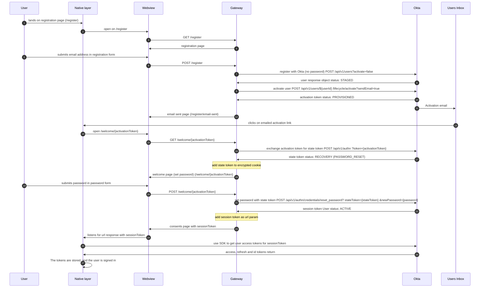

### Apps registration with Okta

The approach for registration in native apps uses the Okta SDK along with a webview for displaying the registration web page.

The main steps for the user in the registration process are as follows:

1. Enters their email address to register with (step 5 in diagram)
2. They are sent an activation email (step 11 in diagram)
3. They click the activation link within the email (step 13 in diagram)
4. This link opens a webview in the native app again (step 14 in diagram)
5. The User enters their password and submits the form (step 19)
6. The User is taken out of the webview and is signed in to the native app (step 25)

# Diagram

