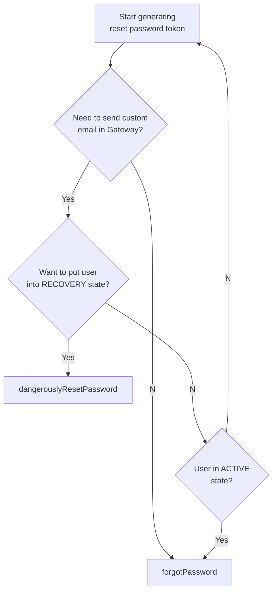

# Resetting passwords and generating password reset tokens in Okta

These are some notes which might be helpful, giving an overview of the ways we reset user passwords in Okta.

All reset password operations are asynchronous and two-stage. First, we generate a reset password token within Okta. This is a short-lived token (60 minute expiry), and is emailed to the user. Then, the user posts their new password to the `/reset_password/:token` route, which will check if the token is valid and use the `resetPassword` function, which calls `/api/v1/authn/credentials/reset_password`, to complete the reset password operation.

## Generating password reset tokens

There are three ways to generate the reset password token for the first step of the operation.

| Gateway function           | Okta endpoint                                   | Original user state | Puts user into non-`ACTIVE` state | Sends an email through Okta     | Returns a recovery token         |
| -------------------------- | ----------------------------------------------- | ------------------- | --------------------------------- | ------------------------------- | -------------------------------- |
| `dangerouslyResetPassword` | `/api/v1/users/:id/lifecycle/reset_password`    | Any                 | Yes ✅ (`RECOVERY`)               | Yes ✅ (with `sendEmail: true`) | Yes ✅ (with `sendEmail: false`) |
| `sendForgotPasswordEmail`  | `/api/v1/authn/recovery/password`               | ???                 | No\* ❌                           | Yes ✅                          | No ❌                            |
| `forgotPassword`           | `/api/v1/users/:id/credentials/forgot_password` | `ACTIVE`            | No ❌                             | Yes ✅ (with `sendEmail: true`) | Yes ✅ (with `sendEmail: false`) |

\* `api/v1/authn/recovery/password` can be used two ways - as a user-initiated flow, which doesn't change the user's status, or as an admin-initiated flow, which puts them into `RECOVERY`. We use it only the first way.

We use the three functions in different contexts:

- `dangerouslyResetPassword` is used to:
  - Create a password for a social user who doesn't have one (this is the only way to do so)
  - Send a forgot password email to a `RECOVERY` or `PASSWORD_EXPIRED` user
- `sendForgotPasswordEmail` is used to:
  - Send a forgot password email to an `ACTIVE` user.
- `forgotPassword` is used to:
  - Generate a password reset token which we put into a custom email we send via Gateway to unvalidated users. For this operation, we can't use `dangerouslyResetPassword` because we don't want to put them into a non-`ACTIVE` state, and we can't use `sendForgotPasswordEmail` because we need to control the custom content of the email.

