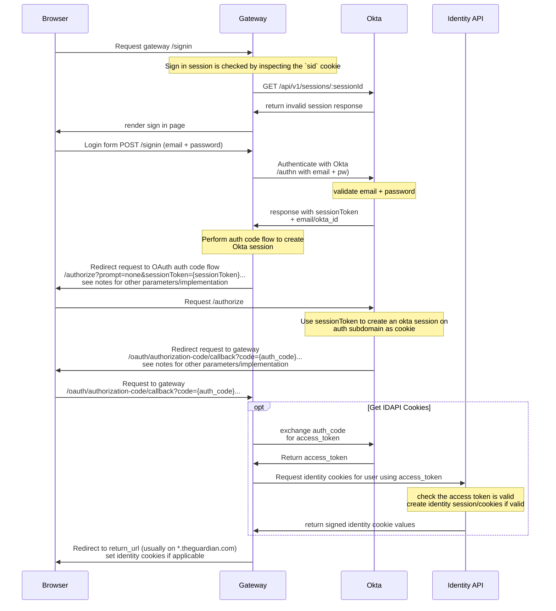
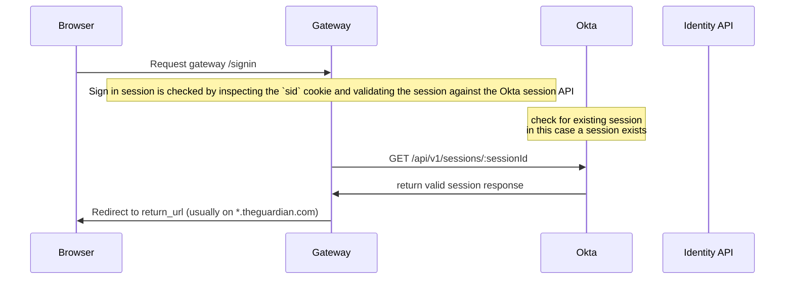

# Sign In with Okta

This document describes how we've implemented the sign in flow with Okta in Gateway. There are two parts to this, sign in with email + password, and sign in with social (_still TBD_).

## Email + Password

The bulk of the work to implement sign in with email and password with Okta was done in this PR: https://github.com/guardian/gateway/pull/1410, which has some additional information, and specific commits you can follow along.

We use the [Okta Authentication API](https://developer.okta.com/docs/api/resources/authn) to implement this, specifically the [Primary authentication with public application](https://developer.okta.com/docs/reference/api/authn/#primary-authentication-with-public-application) operation.

To create a session we [retrieve a session cookie through the OpenID Connect authorization endpoint](https://developer.okta.com/docs/guides/session-cookie/main/#retrieve-a-session-cookie-through-the-openid-connect-authorization-endpoint), which implements the [Authorization Code flow](https://developer.okta.com/docs/concepts/oauth-openid/#authorization-code-flow).

More information about OAuth, OpenId Connect, and our usage of it, is available in the [./oauth.md](./oauth.md) document.

As we don't want users with existing sessions to be shown the sign in page, we all implement an existing session check, which also utilises the same flow, if a session exists we complete the flow and refresh the existing session, if a session does not exist Okta responds with an `error=login_required` parameter which we can intercept and use.

Throughout the implementation of the sign in code, there are many in line comments that explain what is happening.

In general the steps of sign in with email and password are summarised as follows, assuming okta is enabled, this does not detail all technical requirements, just the main high level:

- User navigates to `/signin`
  - Check `sid` cookie for existing Okta session, if this is present it checks if the session is still valid.
  - If the current session does not exist, or is invalid, sign in page shown
    - user enters email and password, makes request to gateway `POST /signin`
    - Use okta authenticate endpoint with the email and password `/api/v1/authn`
      - If email/password wrong, show `email or password was incorrect` error
      - If correct, okta returns a single use `sessionToken` which can be exchanged for an session cookie
        - to exchange this for a session cookie, we perform the auth code flow, pass the `sessionToken` to `/authorize` and redirect to okta `/authorize`
          - Okta will redirect to callback endpoint `/oauth/authorization-code/callback`
          - if all good, a session cookie will be set on okta domain, complete the auth code flow and refreshing identity cookies
          - redirect to original `returnUrl`

Here are some sequence diagrams which show this flow in an alternate way:

### No Okta session exists

### Okta session exists

