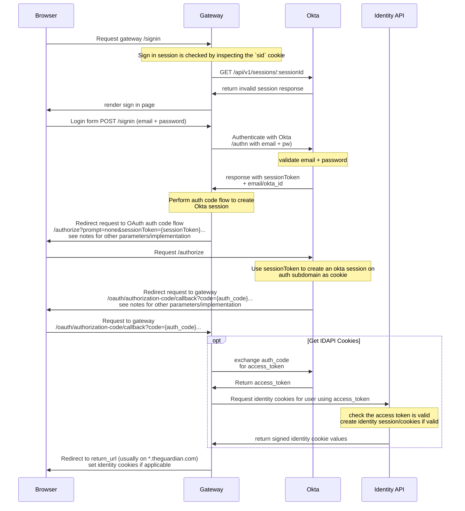
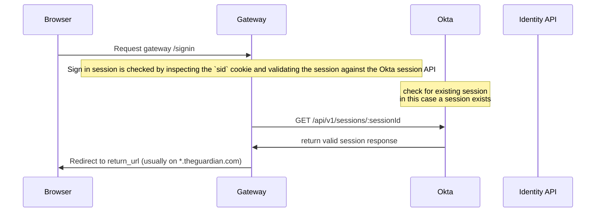
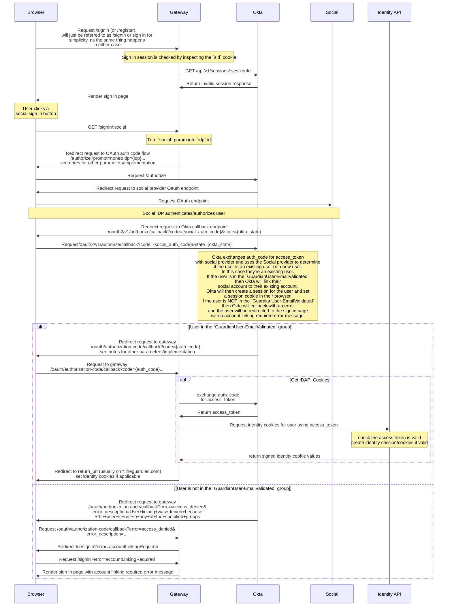
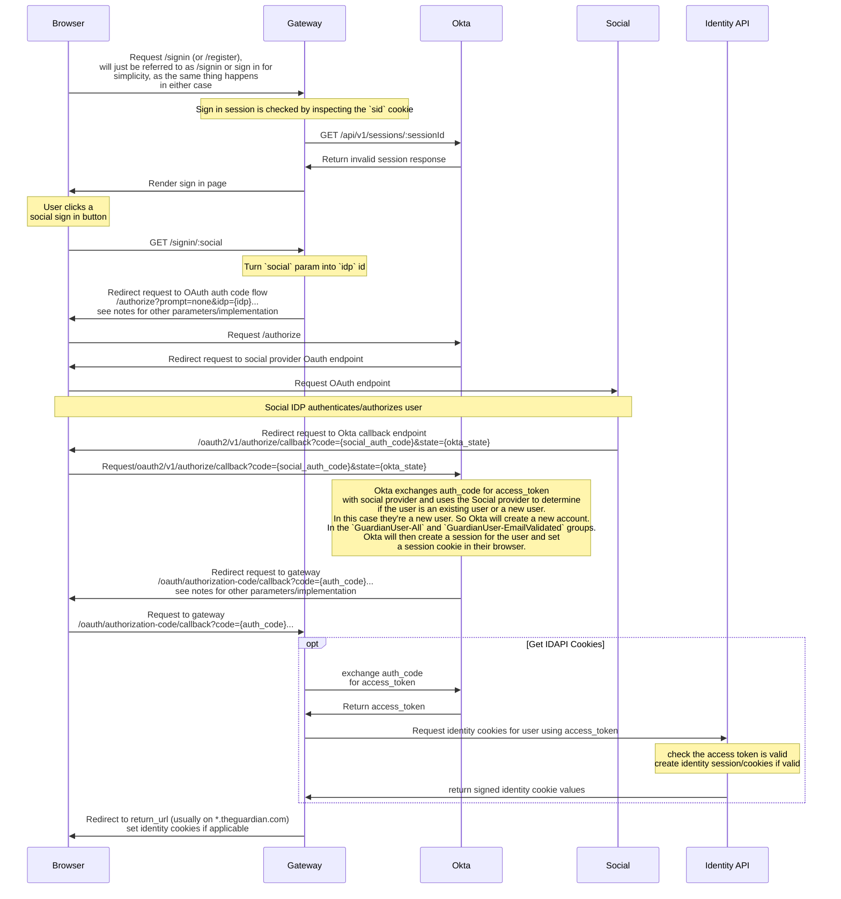
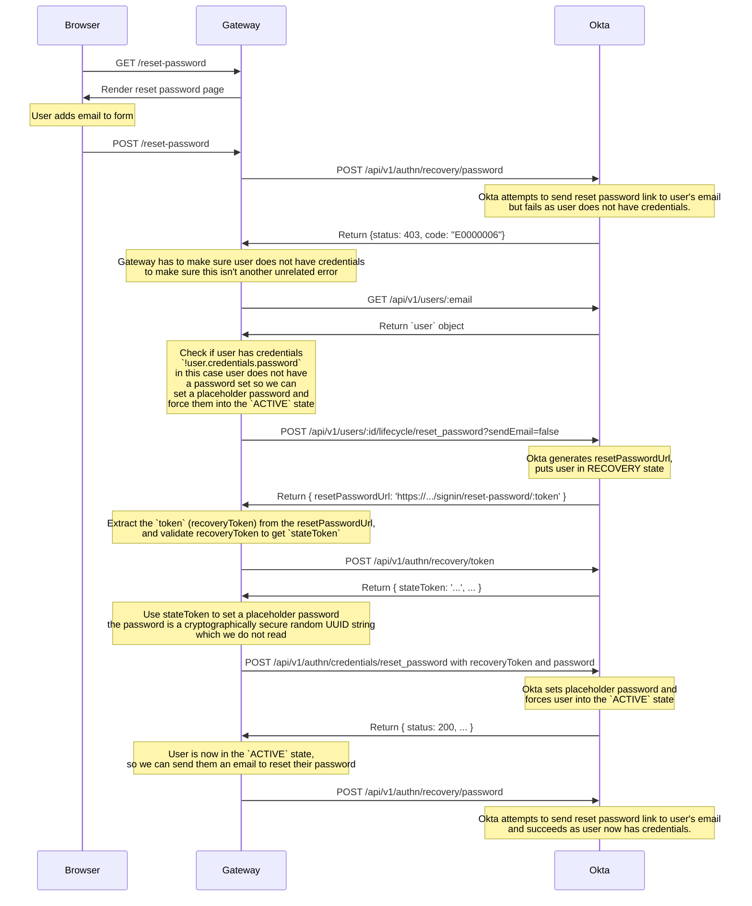

# Sign In with Okta

This document describes how we've implemented the sign in flow with Okta in Gateway. There are two parts to this, sign in with email + password, and sign in with social.

## Email + Password

The bulk of the work to implement sign in with email and password with Okta was done in this PR: https://github.com/guardian/gateway/pull/1410, which has some additional information, and specific commits you can follow along.

We use the [Okta Authentication API](https://developer.okta.com/docs/api/resources/authn) to implement this, specifically the [Primary authentication with public application](https://developer.okta.com/docs/reference/api/authn/#primary-authentication-with-public-application) operation.

To create a session we [retrieve a session cookie through the OpenID Connect authorization endpoint](https://developer.okta.com/docs/guides/session-cookie/main/#retrieve-a-session-cookie-through-the-openid-connect-authorization-endpoint), which implements the [Authorization Code flow](https://developer.okta.com/docs/concepts/oauth-openid/#authorization-code-flow).

More information about OAuth, OpenId Connect, and our usage of it, is available in the [./oauth.md](./oauth.md) document.

As we don't want users with existing sessions to be shown the sign in page, we all implement an existing session check, which also utilises the same flow, if a session exists we complete the flow and refresh the existing session, if a session does not exist Okta responds with an `error=login_required` parameter which we can intercept and use.

Throughout the implementation of the sign in code, there are many in line comments that explain what is happening.

In general the steps of sign in with email and password are summarised as follows, assuming okta is enabled, this does not detail all technical requirements, just the main high level:

- User navigates to `/signin`
  - Check `sid` cookie for existing Okta session, if this is present it checks if the session is still valid.
  - If the current session does not exist, or is invalid, sign in page shown
    - user enters email and password, makes request to gateway `POST /signin`
    - Use okta authenticate endpoint with the email and password `/api/v1/authn`
      - If email/password wrong, show `email or password was incorrect` error
      - If correct, okta returns a single use `sessionToken` which can be exchanged for an session cookie
        - to exchange this for a session cookie, we perform the auth code flow, pass the `sessionToken` to `/authorize` and redirect to okta `/authorize`
          - Okta will redirect to callback endpoint `/oauth/authorization-code/callback`
          - if all good, a session cookie will be set on okta domain, complete the auth code flow and refreshing identity cookies
          - redirect to original `returnUrl`

Here are some sequence diagrams which show this flow in an alternate way:

### No Okta session exists

### Okta session exists

## Social

Social sign in uses the authorization code flow to perform authentication with the social provider. This is done by directly redirecting the user to the Okta custom authorization server `/authorize` endpoint (similar to what we do post sign in to set a session with Okta) with the `idp` parameter, which is the ID of the Social Identity Provider defined within our Okta tenant. The user then authenticates (if required) and authorizes the application on the social provider, and the social provider does a callback to Okta authorizing the user. Okta will then check the state of the user, e.g. if they're a new or existing user, and take the appropriate action. Okta will then authenticate the user and set a session cookie in that users browser.

Once the user is authenticated with the session cookies, Okta will complete the authorization code flow that was started in Gateway, and does a callback to the `/oauth/authorization-code/callback` endpoint (the same as how it works for email + password). We then exchange the auth code for the access tokens, get the old identity cookies if required, and redirect the user back to the return url.

### Existing users

For existing users in Okta, we automatically link their account. We also restrict automatic account linking to users within the `GuardianUser-EmailValidated` group to mitigate account squatting, as we know that users in the email validated group have validated they own the account through access in their email inbox.

By restricting account linking, the user is blocked from authentication, and we receive a generic ‘User linking was denied because the user is not in any of the specified groups’ error without any user details. In this case we use this error to display a custom error message on the sign-in page but we won’t be able to auto-fill the email address because we won’t know what it is. This is roughly equivalent to what we already have with a slightly degraded user experience as the email is not pre-populated. It does not perform any manual account linking.

### New users

If a user doesn't exist and tries to sign-in with social, we create them automatically using JIT (just in time) provisioning which creates a new user record. When a user is created by JIT, we can automatically assign them to a group, in our case we assign them to the `GuardianUser-All` and `GuardianUser-EmailValidated` groups, which match similarly to what we have in old Identity land.

A new user that registers with a social account becomes `ACTIVE` in Okta, with the `SOCIAL` provider and no password set. This creates some issues regarding reset password.

When a `SOCIAL` user tries to reset their password using a reset/forgot password form, the request will fail with an error mentioning they do not have permissions to take that action. To be able to send a password reset email to the user we have to get them from the `SOCIAL` provider to the `OKTA` provider with the `ACTIVE` state and a placeholder/temporary password set.

### Reset password for new users

This takes a few steps to do to get a user into the correct state with a placeholder password set.

Firstly we listen out for the error when a user attempts to reset their password.

When we see this error we run a few checks to make sure the user is in the particular state without a password set. We first get the `user` object by using their email. This may have a `credentials` property. When a user does not have a password set the `user.credentials.password` object will not exist, so we can use this to perform logic.

When a password isn't set, we HAVE to use the users api reset password endpoint ([method](https://github.com/guardian/gateway/blob/585b4d0f7b65e2acec156a2acd48b4a1cad14d55/src/server/lib/okta/api/users.ts#L177)/[api doc](https://developer.okta.com/docs/reference/api/users/#reset-password)), this forces the user from the `SOCIAL` provider to the `OKTA` provider, and into the `RECOVERY` state. No other endpoint does this, so we have to use this endpoint.

This returns a one time recovery token, which we don't send to the user. We use this token to get the authentication `stateToken`.
We then use this `stateToken` to set a randomly generated unreadable password, and this forces the user into the `ACTIVE` state with a password set.
Now the user is in this state we can send a user an email to be able to reset their password.

