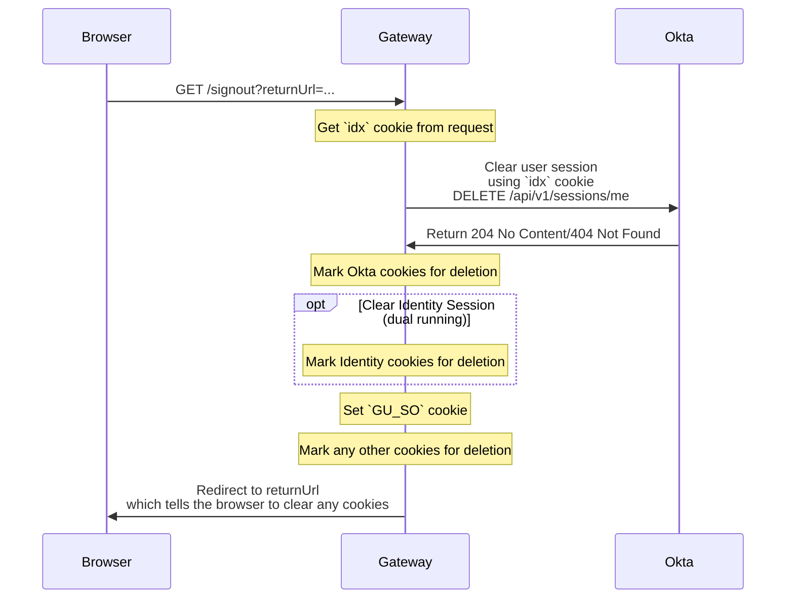
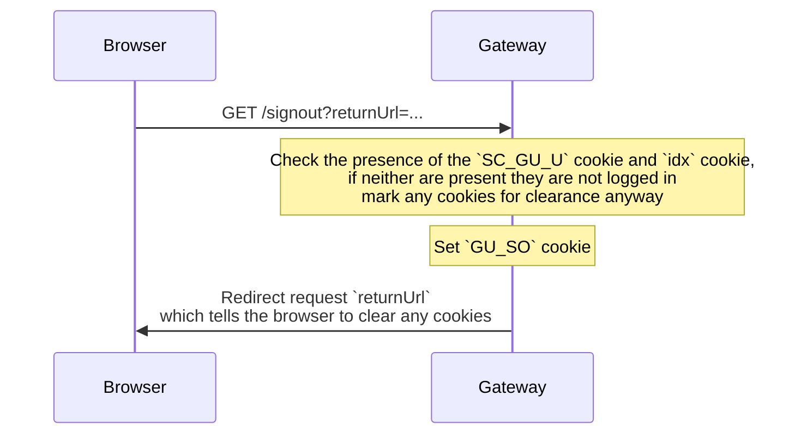

# Sign Out with Okta

This document describes how we've implemented the sign out flow with Okta in Gateway.

In old (current) Identity land, when a user clicks the "sign out" button on the website, or visit the sign out link directly, if they have a valid session, determined using the `SC_GU_U` cookie, Identity API will invalidate all existing user sessions on all devices and browsers, and clear all Identity and related dotcom cookies on the current browser.

This doesn't provide a great user experience, as users will be signed out of all devices and browsers, and will need to sign in again on all of them.

Okta provides a Sessions API endpoint the current user session on the device/browser, and we can use this to invalidate the current session for a user.

https://developer.okta.com/docs/api/openapi/okta-management/management/tag/Session/#tag/Session/operation/closeCurrentSession

This endpoint requires the okta session cookie, which we use the current okta session id cookie `idx`

In the scenario where the okta call to remove the session fails (and we have a orphaned session), we delete the `idx` cookie anyway, and we plan in the future to allow the users to see their active sessions in manage my account section of the site where they can remove them manually.

If there is no existing session then we'll just redirect to the `returnUrl` and clear any cookies should they exist.

During the dual running of the system we also need to clear the Identity session too, we now do this by just clearing the IDAPI cookies.

We then set the `GU_SO` which identifies that the user has signed out recently, and tells applications to clear any OAuth tokens they have for the user.

### User has existing session

### User has no existing session

# Global sign out

User help sometimes sends users to a global sign out endpoint which will sign them out of all devices and browsers which is helpful for specific user scenarios. This was previously done by sending users to the `/signout` endpoint which would sign them out of all devices and browsers in Okta and Identity.

This new endpoint is `GET /signout/all` which does this behaviour.

Okta provides an administrative API endpoint within the Users API to clear all user sessions, and we can use this to invalidate all sessions for a user, as well as revoke all access and refresh tokens that are currently valid.

https://developer.okta.com/docs/reference/api/users/#clear-user-sessions

This endpoint requires the okta `userId`, which we get from the okta sessions api using the current okta session id cookie `idx`

We then use this user id to clear all Okta sessions for that user.

We also need to clear the Identity session too, we do this by calling the `/unauth` endpoint on the Identity API, which will clear the IDAPI session using the`SC_GU_U` cookie.

We then set the `GU_SO` which identifies that the user has signed out recently.
