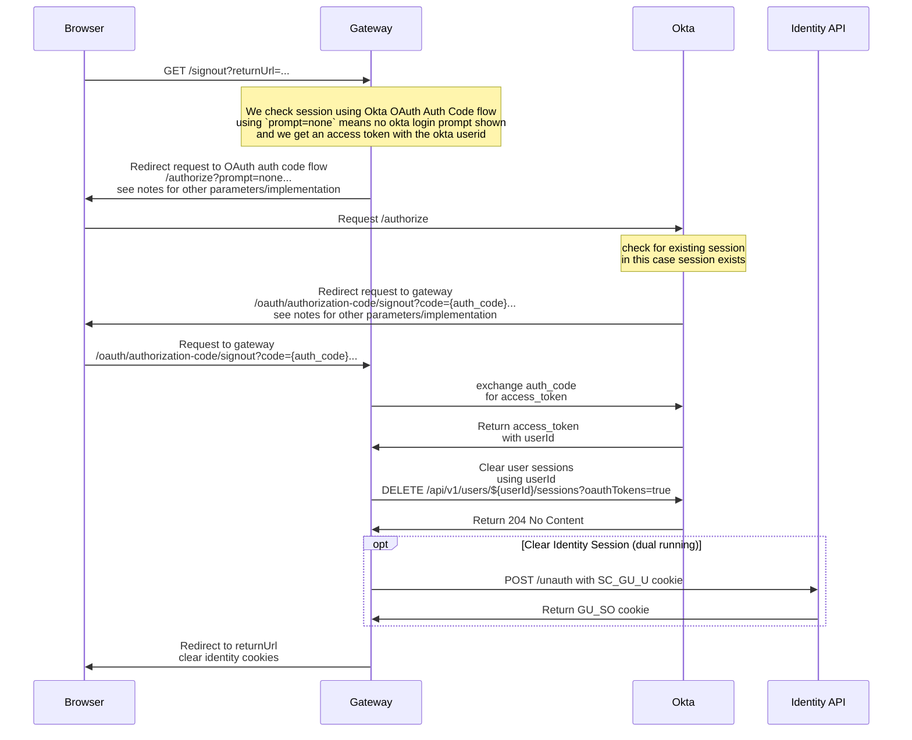
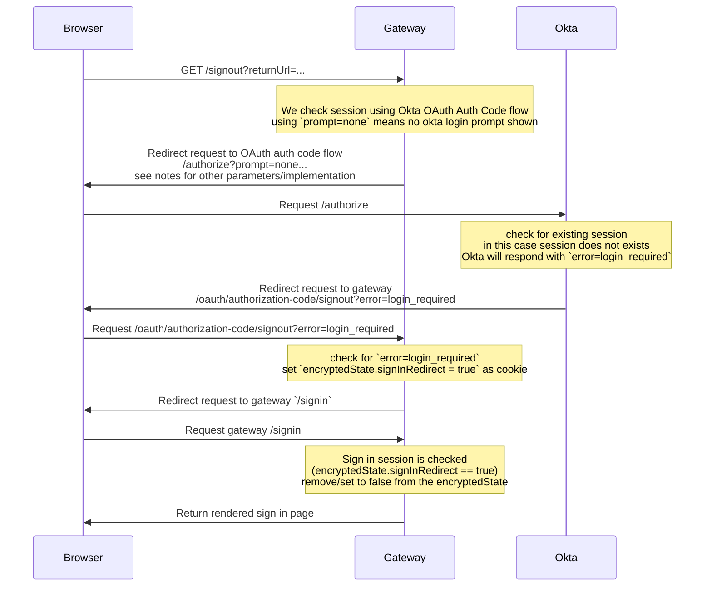

# Sign Out with Okta

Status: RFC

This document describes how we've implemented the sign out flow with Okta in Gateway.

In old (current) Identity land, when a user clicks the "sign out" button on the website, or visit the sign out link directly, if they have a valid session, determined using the `SC_GU_U` cookie, Identity API will invalidate all existing user sessions on all devices and browsers, and clear all Identity and related dotcom cookies on the current browser.

Since we're dual running Identity and Okta sessions, this functionality should also be replicated with the Okta sign out for now.

Okta provides an administrative API endpoint within the Users API to clear all user sessions, and we can use this to invalidate all sessions for a user, as well as revoke all access and refresh tokens that are currently valid.

https://developer.okta.com/docs/reference/api/users/#clear-user-sessions

This endpoint requires the okta `userId`, which we won't have access to initially, so we need to get an access/id token with this information.

This means when a user lands on the `/signout` url, we first perform an auth code flow to get an access token, and then we can use that access token to get the user's id. We then use this user id to clear all sessions for that user.

If there is no existing session then we'll render the sign in page.

During the dual running of the system we also need to clear the Identity session too. We can use this access token or the SC_GU_U cookie to call Identity API (TBD which option) to do this.

### User has existing session

### User has no existing session

