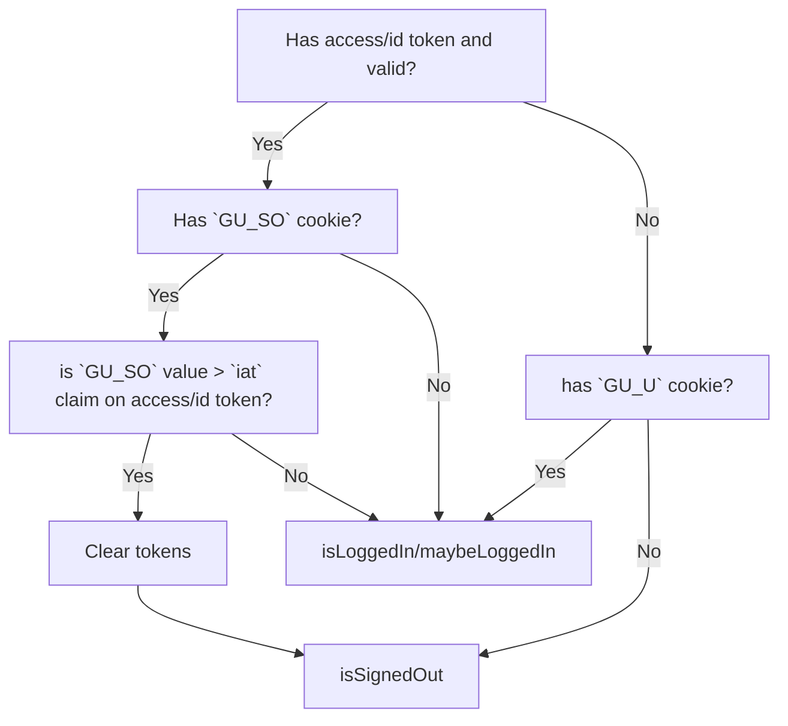
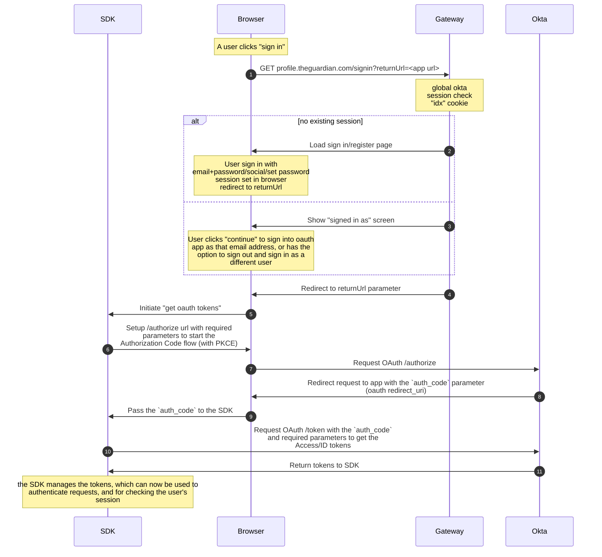
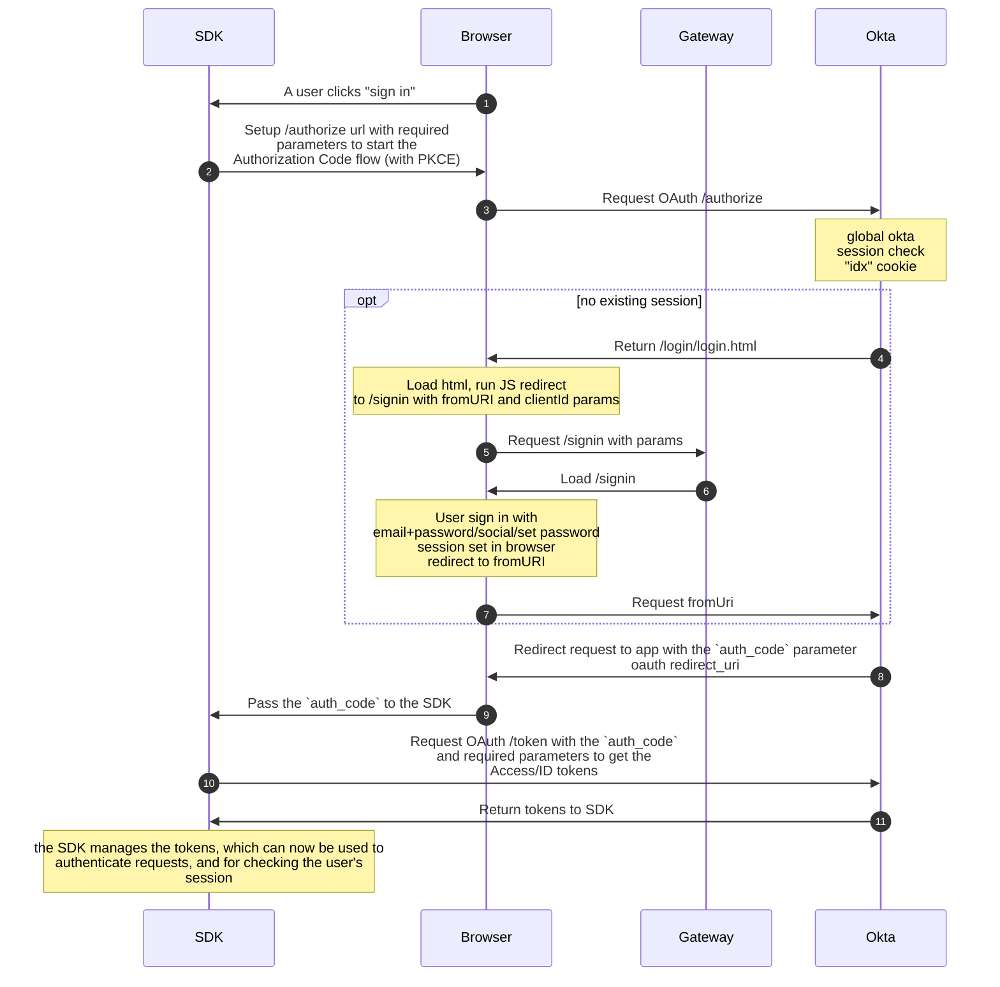

# Web apps integration with Okta

This is all subject to change following the outcomes of the spike work in web application migration.

## Context

We're moving to use the [OAuth 2.0 Authorization Framework](https://www.rfc-editor.org/rfc/rfc6749) and the [OpenID Connect](https://openid.net/specs/openid-connect-core-1_0.html) (OIDC) protocol for authentication and authorisation. This is a standardised way of authenticating readers and authorising them to access resources. It is used by many other companies, including Google, Facebook, Twitter, Microsoft, and Amazon.

While the RFCs are quite long and detailed, this document will give you a quick overview of how to integrate Guardian web apps with Okta. We also go over any additions that we've added outside of the standards.

## Overview

The key consideration when integrating Guardian web applications with Okta is that everything should be seamless for users.

This means that the entire process should ideally be transparent to the user, they should not notice any difference in the way they log in. They should not notice any obvious redirects or refreshes happening. They should not be asked to log in again if they already have a global session set.

In general the only things to consider when integrating a web application with OAuth is how to retrieve, use, and renew the OAuth tokens, specifically the access and id tokens.

Ideally we want this process to be transparent and seamless for our readers. This means we don’t want to use too many redirects, or constantly ask the reader to log in if they have a session set. Also we don’t want to mandate login, so we want to only attempt to get OAuth tokens should an Okta global session is already set.

Web applications can authenticate the reader in two ways depending on the technology and the application:

1. Primarily client side, e.g. SPA, JavaScript fetch methods, etc.
2. Primarily server side, e.g. http forms, server side pages, etc.

In the integration guide we go over how to perform authentication in both cases further down.

OAuth has multiple different ways of authenticating a reader, and for web applications we will only use the [Authorization Code Flow](https://www.rfc-editor.org/rfc/rfc6749#section-4.1), ideally with the [Proof Key for Code Exchange](https://tools.ietf.org/html/rfc7636) (PKCE) extension. This is the most secure way of authenticating a reader, and is the recommended way of authenticating a reader in a web application.

Once the OAuth flow is completed, the application will get two tokens, an access token and an id token. The access token is used to authenticate the reader to an API, and the id token is used to retrieve the reader's profile information within the app. More information about tokens can be found in the [Tokens](tokens.md) document. But in general the following rules apply for each type:

- Access Token

  - Should only be used to authenticate the reader to an API, and should not be used to read reader profile information directly from the token.
  - An example of this would be to use the access token to call members-data-api to retrieve the reader's subscription status, or discussion-api to post a comment, etc.

- Id Token
  - Should only be used to read a reader profile information, and should not be used to authenticate the reader to an API.
  - An example of this would be to read the access token to read the readers email, name, etc. to display in the app.

There is a third type of token, which is optional, and we don't recommend for web applications. The refresh token. These are used to renew the access and id tokens, to keep the reader logged in outside of the Okta global session. This is more useful for native apps rather than web apps.

## Setup

To setup a web application app, we will need to register the application as an client within Okta. The identity team will be able to do this for you. Depending on if the application is primarily client side or server side, the setup may be slightly different, but in general the following things will be required:

1. A redirect callback URI for OAuth authorization callback
   - This is endpoint the reader is redirected back to after the reader authenticates with Okta as part of the OAuth Authorization Code Flow.
   - This endpoint should handle the authorization code and exchange it for an access token and id token.
   - This could be set to a wildcard, but this isn't recommended as it could be used for phishing attacks.
   - e.g. `https://profile.theguardian.com/oauth/authorization-code/callback`
   - When using the iframe method (only client side, using `response_type=okta_post_message` parameter) for getting/refreshing tokens, this redirect URI must match the base domain of the application, e.g. `https://profile.theguardian.com`
2. A list of scopes required for the application
   - This is the permissions that the application will have when using the OAuth tokens.
   - e.g. `openid profile email`
   - More information about scopes can be found in the [Tokens](tokens.md#scopes) document which we recommend reading.
   - Access tokens should only have the minimum scopes required for your application to authorise the APIs it needs to access on behalf of the reader, e.g. members-data-api, discussion-api, etc. The Identity team can provide a list of scopes that you'll need for that. A scope looks like the following: `guardian.members-data-api.complete.read.self.secure`
   - ID tokens are used to read the reader's profile information, and should have the `openid` and `profile` scopes at the minimum, and we can add in additional fields (called `claims`) specific to the application if required with a specific application scope e.g. `id_token.profile.ios_live_app`

We will need a set for the PROD, CODE, and possibly DEV environments.

Once the app is set up within Okta and this project. The Identity team will give you the following information to configure the Okta SDK:

| Name         | Key                          | Explanation                                                                                                                                                                                                                                                    | Example                                                             |
| ------------ | ---------------------------- | -------------------------------------------------------------------------------------------------------------------------------------------------------------------------------------------------------------------------------------------------------------- | ------------------------------------------------------------------- |
| Client ID    | `client_id`/`clientId`       | The client ID from the app integration that was created                                                                                                                                                                                                        | `0ux3rutxocxFX9xyz3t9`                                              |
| Issuer       | `discovery_uri`/`issuer`     | Domain of the Okta app, followed by the OAuth authorization server. We use a custom authorization server rather than the default one as it lets us customise lifetimes of tokens                                                                               | `https://profile.theguardian.com/oauth2/aus2qtyn7pS1YsVLs0x7`       |
| Redirect URI | `redirect_uri`/`redirectUri` | The Redirect URI from the app integration that was created                                                                                                                                                                                                     | `https://profile.theguardian.com/oauth/authorization-code/callback` |
| Scopes       | `scopes`                     | Default permissions for the OAuth tokens, you'll want `openid profile` at the minimum, additional scopes might be needed for calling certain APIs. Information about the scopes can be seen [here](https://developer.okta.com/docs/reference/api/oidc/#scopes) | `openid profile` or json `["openid", "profile"]`                    |

### Client Side

#### Library Options

~~Can’t use the Okta SDK directly as its super huge even when gzipped (72.7 kB minified + gzipped)~~

~~https://bundlephobia.com/package/@okta/okta-auth-js@7.2.0~~

~~We’ll have to use a smaller OAuth library, or implement our own with a subset of the functionality required. Also investigate if tree shaking is possible with the Okta SDK.~~

~~https://bundlephobia.com/package/oidc-client-ts@2.2.1 (17 kB minified + gzipped)
Open ID compliant, ESM + CommonJS + Browser. Also included is support for reader session and access token management.~~

~~https://bundlephobia.com/package/oauth4webapi@2.0.6 (8.1 kB minified + gzipped)
Open ID compliant, ESM only, uses Web APIs. No support for reader session/token management.~~

In general a library should provide the following features:

- “Sign in” the reader to the app
- i.e performing the Authorization Code Flow to retrieve access and id tokens
- Token management
  - Storage
  - Retrieval
  - Refresh
- User management
  - “isSignedIn” method
  - Reading user claims from ID token

~~A compelling option is to create our own library, which would be a subset of the Okta SDK. This would be a good option if we want to minimise the size of the library, and also have more control over the OAuth flow. We could also make a wrapper around the Okta SDK, which would be a good option if we want to minimise the amount of work required to implement the OAuth flow, and only make available the features we need.~~

We've now created our own library which implements a sub-set of the features that the Okta library provides. It is available in [`@guardian/csnx`](https://github.com/guardian/csnx) repo, specifically the [`@guardian/identity-auth`](https://github.com/guardian/csnx/tree/main/libs/%40guardian/identity-auth) library ([npm](https://www.npmjs.com/package/@guardian/identity-auth)). Our library only uses some of the same classes and methods as the official SDK, but the implementation of them is our own. Currently it only supports the `okta_post_message` `response_mode` parameter, which means that it only gets Access and ID tokens through performing the Authorization Code Flow from within an iframe on the page, this avoids any redirects.

#### OAuth Considerations

We will want to use the OAuth Authorization Code Flow with PKCE.

Also we want to minimise the number of redirects when using the client side OAuth after a session is set.

We can do this as the reader logs in, e.g by changing all sign in links to `/authorize` calls. We’d have to provide some kind of callback route on `theguardian.com` website to handle this and redirect the user back to the page they were on. Or use a wildcard redirect URI and allow any page to be used as a callback.

We're also able to silently get access and id tokens through the Authorization Code flow. Okta provides this functionality through iframes and `postMessage` in their SDK called `token.getWithoutPrompt(options)`. This is useful for when the reader is already logged in, and we want to get a new access token without having to redirect the reader through another Authorization Code flow.

#### Token management and storage

Using an SDK also provides methods to manage and store tokens easily.

Since client side storage has limited storage options. We have the option of LocalStorage, SessionStorage, and js cookies.

The most secure of these would be LocalStorage, which is the recommended way of storing access tokens on the client side, despite possible security concerns e.g. with XSS. But much of these are mitigated by using short lived tokens.

Expiry should be set to the minimum required, and refreshed when required, ideally using the silent approach.

### Server Side

#### Library Options

On the server side we have options for multiple libraries and standards for authentication. Since we don’t have to worry about bundle sizes we can use any OAuth/OpenID Connect compliant library.

In this project (Gateway) we already use https://github.com/panva/node-openid-client to generate oauth tokens, which are only used to authenticate with identity API to create the existing cookies for the readers.

There are other options available https://openid.net/developers/certified/ and https://developer.okta.com/code/

We also use [`@okta/jwt-verifier`](https://github.com/okta/okta-jwt-verifier-js) in order to verify the JWT access and id tokens on the server side.

#### OAuth Considerations

We’d want to use the Authorization Code Flow (optionally with PKCE, but don’t have to as secrets can be stored securely server side).

When we do this depends on when we need user information in the server side application.

If we need user information when the user comes to the page, we can check if the user is "maybeLoggedIn" and if so, go through the Authorization Code flow to get the user information.

Otherwise we can ask the user to click a button to sign in, and then go through the Authorization Code flow to get the user information when the application needs it.

We'll want to think about the number of redirects.

#### Token management and storage

These will be stored as HTTPOnly, Secure cookies with a limited expiry.

Expiry should be set to the minimum required to avoid unnecessary refreshes.

Refresh should be attempted by going through the Authorization Code flow again, if the access token/id token is expired, and the “maybeLoggedIn” cookie is valid.

## Integration guide

### How to know if a reader is signed in?

Since we're moving away from using a single cookie valid across all Guardian domains to authenticate and authorise the readers, we will need to have a different way to know if a reader is signed in.

In general the following rules apply:

1. Check if the reader has a valid access token and id token. This does not mean that the current reader is definitely signed in, so we have to perform additional checks.
2. If the reader has valid access token and id token, check if the reader has a valid `GU_SO` cookie. If the reader has a valid `GU_SO` cookie, that means a reader has recently signed out, so we need to check whether we should clear the tokens. This is done by checking the `iat` claim on the access and id tokens, and comparing it to the `GU_SO` cookie value.
   - If the `GU_SO` cookie value is greater than the `iat` claim in the access/id tokens (a reader signed out after the tokens were issued), then the tokens should be cleared, and the reader is not signed in to the current application.
   - If the `GU_SO` cookie value is less than the `iat` claim in the access/id tokens (a reader signed out before the tokens were issued), then the tokens should not be cleared, and the reader is signed in to the current application.
   - If there is no `GU_SO` cookie, then the reader is signed in to the current application.
3. If the access token and id token are expired/do not exist, but the reader has a valid `GU_U` cookie, they might be signed in (`maybeLoggedIn`).
   - We can't be definitely sure if they are signed in until they attempt to go through the Authorization Code flow to attempt to get a new access token and id token.
   - This is where the Global session cookie will be checked as part of the Authorization Code flow, which is the `idx` cookie which is only valid on `profile` subdomain and managed by Okta.
4. If the reader has neither a valid access token and id token, nor a valid `GU_U` cookie, they are signed out.

By using this `isLoggedIn`/`maybeLoggedIn` and `isSignedOut` states, we can avoid making unnecessary API calls to Okta to check if the reader is signed in, and not lower our security by making the global session cookie available to all Guardian domains.

We already set a `GU_U` cookie which is valid across all Guardian domains, but is not used to take any actions on behalf of the reader (this is performed by the secure, httpOnly, `SC_GU_U` cookie). We can keep using this cookie to determine if the reader is `maybeLoggedIn`.

The `GU_U` cookie and the `idx` cookie will lead to the following scenarios:

- `GU_U` && `idx`
  - Signed in fully state, can complete authorization flow and get tokens
- `GU_U` && !`idx`
  - `idx` cookie expired or deleted
  - Error when attempting to get new tokens, can delete `GU_U` cookie to get to signed out state
- !`GU_U` && `idx`
  - `GU_U` cookie expired or deleted, similar to signed out state
  - When a user goes to log in they will see “signed in as” screen, or be silently logged in if not using “prompt=login” parameter
- !`GU_U` && !`idx`
  - Signed out state

This will also help Ophan, which currently uses the `GU_U` cookie to extract the user id from the cookie to join data. This approach also works on both the server and client side, where the `GU_U` cookie can be read by the application before attempting to perform the authorization code flow.

From the `maybeLoggedIn` state, you can attempt to get the access token and id token by going through the Authorization Code flow. If the reader is signed in with a global Okta session, the flow will complete and the tokens will be returned. If the reader is signed out, the flow will fail you can choose what should happen next.

### When to refresh tokens?

We can refresh token when the access token and id token are expired, and the reader is `maybeLoggedIn`.

This is the (access_token expired && id_token expired && `GU_U` cookie valid) state.

We can also refresh tokens anytime when the reader has valid access token and id token.

### How to sign readers in?

In Okta land "Sign In" can mean two different things. More information about this can be seen in the [Sessions](sessions.md) document. But in general there are two sign in states:

1. The global Okta session (where the `idx` cookie is set)
2. The application session (where OAuth tokens come into play)

It's possible to sign into each one individually, but in most cases we want to sign into the application session only when the global Okta session is valid.

The global Okta session is set when the user authenticates with their credentials, whether that's with email/password, or with a social provider. This is currently done by directing the user to the `profile` subdomain, and the `/signin` endpoint. The global session is also set after registration and reset password.

A user "signs in" to an app/client by going through one of the OAuth flows, in our case we only ever want to use one of the flows: Authorization Code flow (ideally with PKCE). This is what’s used to get the Access/ID tokens. During this flow, the global session is checked to see if the user is logged in, if so the user is authenticated and the tokens returned, if not the user can be optionally asked to authenticate first, thereby signing into the global session during the Authorization Code flow first.

This gives us two options on how to do "sign in":

1. Sign the user into the global session first, and then the application.
   - Sign in links use `profile.theguardian.com/signin?returnUrl=<app url>` to sign the user in.
   - Once the user authenticates and the global session is set (namely the `idx` cookie, and the `GU_U` cookie), the user is redirected back to the application, and the application can then go through the Authorization Code flow to get the tokens, whether through redirect method or the iframe method.
   - This provides a separation of concerns between the global session and the application session.
   - The same logic from the 2nd bullet point can be used to get and refresh access/id tokens.
   - Two step process may cause complications if this isn't set up correctly, e.g. lots of redirects, or the user is signed in to the global session but not the application session, etc.
2. Sign the user into global session and application at the same time through the Authorization Code flow.
   - Sign in links become `/authorize` urls, e.g. `profile.theguardian.com/authorize?client_id=...&redirect_uri=...&response_type=code&scope=openid&state=...`
   - Or a link which generates and redirects to the `/authorize` url
   - This is what's currently happening in some other Guardian system, namely the [Jobs site](https://jobs.theguardian.com) and the [Native apps](native-apps-integration-guide.md). And is usually the approach taken by most things using OAuth.

Our recommendation is to ideally implement both possibilities to cover all cases of sign in. This is because the 2nd option is most "OAuthy" and used by other systems and minimizes complication and redirects, but the 1st option will be required anyway in order to refresh tokens.

This could be handled by an SDK.

#### Option 1

#### Option 2

### How would I get a user’s details to display?

The Id and access tokens hold "claims" about the user, essentially a key-value pair of fields which the token "claims" to have about the user, and is only validated through verifying the signature of the token.

Once validated and decoded, the "claims" can be used within the application to read user information.

The ID token is what a client should read from in order to read and display user information. The access token is used to make API calls to other services, and should not be used to read user information.

Claims are customisable depending on the scopes and application. We want to keep the number of claims to a minimum so that we don’t give away any additional information about the user outside of what is required by the application. Which is unlike what is possible at the moment, where if a user has an `SC_GU_U` cookie, the application/api can read any/all information about the user.

### Where should we store the tokens?

As mentioned, hopefully an SDK should handle this, but the following applies.

Client side applications: Local storage.

Server side applications: HTTPOnly, Secure cookie, at least `SameSite=Lax`, you could also encrypt the cookie for extra security.

### How will sign out work?

At the moment going to the `profile` subdomain and hitting the `/signout` endpoint will invalidate all Okta/OAuth sessions, and revoke all OAuth tokens, however this affects all browsers/devices to match our legacy behaviour. This also clears the `GU_U` cookie (and legacy identity cookies).

We also set the `GU_SO` cookie to make sure apps should clear their tokens should they see this cookie.

We want to change this behaviour to only affect the current browser/device, and not all devices. This is because we want to allow users to sign out of the current device, but still be signed in on other devices.

### What user id should we use?

Carry on using the existing identity id for now, as this is too ingrained to remove easily. We will revisit the identity id after migration.

This will be available as the `legacy_identity_id` claim in the ID token.
